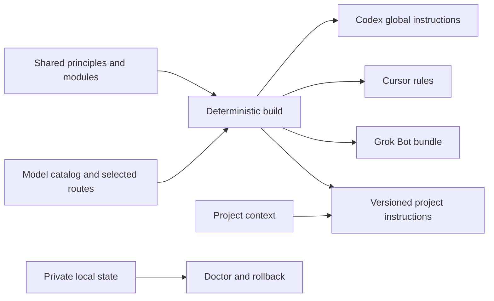

# AI Constitution


> **Your way of working. Every project. Every agent.**

Shared instructions, a refreshable model catalog, and project onboarding for **Codex, Cursor, and xAI Grok Bots**. Keep the principles in one place. Let a small, reversible tool handle the copies.

[](https://github.com/thierry-gilgen-ict/ai-constitution/actions/workflows/checks.yml)
[](LICENSE)
[](docs/getting-started.md)
[](scripts/constitution.py)

**[Start here](docs/getting-started.md) · [Onboard a project](onboarding/project.md) · [Browse models](docs/models.md) · [Update everything](docs/updates.md)**

Switching agents should not mean explaining your working style again. A new model release should not mean finding every stale model name in every project. And a shared configuration should never turn your home directory into a public repository.

AI Constitution connects three jobs that are often maintained separately:

| What you need | What you get |
| --- | --- |
| Consistent behavior | A compact constitution, focused modules, and native client adapters |
| Current model definitions | An offline snapshot of **225 providers and 8,371 provider-scoped models**, fetched October 2, 2026; one-command refresh |
| Easy project setup | A copy-paste onboarding prompt and an installer that preserves existing guidance |
| Predictable maintenance | Generated routing, checksums, drift detection, private backups, and rollback |
| Local model support | Hardware-aware Ollama onboarding, model management, a private dashboard and GPU release with an optional companion |
| Honest compatibility | Separate statements for files installed, instructions loaded, model access, and measured results |

Catalog counts describe the bundled [models.dev](https://models.dev) snapshot, not independently verified access to every model. Aliases and provider-specific offerings are counted separately. [Coverage and provenance](docs/models.md).

## Five-minute start

**Requirements:** Python 3.11+ and Git. No API key, package installation, paid inference, or background service is needed.

```sh
git clone https://github.com/thierry-gilgen-ict/ai-constitution.git
cd ai-constitution
python scripts/constitution.py check
python scripts/constitution.py install --dry-run
python scripts/constitution.py install
```

This installs global Codex and Cursor files, two discoverable skills, and local instruction libraries under `~/.config/ai-constitution/`. Existing Codex guidance is retained in place; model settings are left to the client's supported controls. Start a fresh session and follow the [activation check](checks/acceptance.md).

On Windows, you can substitute `./scripts/constitution.ps1` for `python scripts/constitution.py`.

Onboard a project from the constitution checkout:

```sh
python scripts/constitution.py onboard --project /path/to/project --dry-run
python scripts/constitution.py onboard --project /path/to/project
```

Then give your agent the [onboarding prompt](onboarding/project.md). It fills the project context from evidence. **Installing the template is only the first step.**

For the actual xAI Grok Bot product, follow the [Bot onboarding guide](onboarding/bot.md). It uses the Bot description, shared private skills, and a bundle on the Bot's cloud computer. The local installer does not pretend to configure a remote Bot.

## New models? One command.

```sh
python scripts/constitution.py update
```

Fetch the complete upstream catalog, validate it, show added/changed/removed definitions, and regenerate the routing guide. New upstream providers are included automatically. Removals require an explicit review option; network or schema failures preserve the working snapshot.

**Definitions update automatically; your preferred routes change deliberately.** Downloading a new model description does not switch the model in a running client or establish that your account can use it.

Ask Codex or Cursor:

> Use the constitution-maintenance skill to refresh this project's model definitions, verify relevant provider changes, and review whether our routes should change. Preserve my chosen defaults unless the evidence supports a change. Run the checks and show me the diff.

[Maintenance workflow](docs/updates.md) · [Routing policy](routing.md) · [Evaluation worksheet](checks/evaluation.md)

## Find a model without opening ten tabs

```sh
python scripts/constitution.py providers
python scripts/constitution.py models --provider anthropic --tools
python scripts/constitution.py models --provider openai --search sol --json
python scripts/constitution.py models --provider xai --json
python scripts/constitution.py models --open-weights --tools --limit 10
python scripts/constitution.py route --platform codex --task deep
```

The catalog preserves upstream pricing, context limits, modalities, tool support, reasoning metadata, release dates, and additional fields where present. Unknown means unknown; absent capabilities are never invented.

Local servers work too:

```sh
python scripts/constitution.py local --kind ollama
python scripts/constitution.py local --kind openai-compatible --url http://127.0.0.1:1234/v1
```

These commands list model metadata. They do not load weights or run inference. Inventories stay in private local state. [Local model guide](docs/local-models.md).

## Your local models, ready to work

**Local Control is an optional preview:** choose models for your hardware, download GGUF weights, load or unload models, and route coding sessions through one private endpoint.

```sh
python scripts/local_control.py setup --ollama --llmfit
python scripts/local_control.py serve --open
```

Choose a primary model and a CPU or second-computer fallback in the dashboard. **Gaming mode** checks the fallback, moves new requests, waits for active responses to finish, and verifies GPU memory was released. A local-only Codex session can run directly or inside Cursor's terminal. Windows, macOS and Linux share the same controller and worker code.

This does not replace Cursor's native Agent, migrate an in-progress generation, or pool GPU memory across PCs. Physical Mac and multi-computer validation remain preview milestones. [Setup, compatibility, switching and upgrades →](docs/local-control.md)

## How it fits together



| Layer | Owns | Loaded when |
| --- | --- | --- |
| `constitution.md` | Working defaults | Embedded in the active adapter |
| `engineering.md`, `research.md` | Specialized guidance | Relevant to the task |
| `registry/catalog.json` | Broad provider and model metadata | Queried by the CLI; never stuffed into every prompt |
| `registry/models.json`, `registry/routes.json` | Small, curated client recommendations | Selecting a route |
| `.ai/project.md` in your project | Architecture, commands, project decisions | Working in that project |
| Local state outside the checkout | Enrollment, backups, source observations, local models | Installation and maintenance |

The source repository can live anywhere, including a development drive. Runtime files default to `~/.config/ai-constitution/`. No symlink privileges are required.

## Designed for adoption

- **Preserve existing work.** Managed blocks update in place; edits elsewhere survive. Conflicting managed edits stop synchronization.
- **Work offline.** The catalog and project bundles are local. Network access happens only during requested updates or discovery.
- **Know what changed.** A project lock records its release and hashes. `doctor` checks installed files and reports drift.
- **Recover cleanly.** Installation snapshots restore the previous bytes and refuse to erase subsequent edits.
- **Keep scope clear.** Grok Bot uses managed model selection. Local model discovery is not proof of tool support. Instructions are not permissions enforcement.
- **Upgrade predictably.** `upgrade` fast-forwards a clean checkout and synchronizes enrolled, unpinned targets. [Upgrade guide](docs/updates.md).

## Choose your path

| You are… | Start here |
| --- | --- |
| Setting this up for yourself | [Getting started](docs/getting-started.md) |
| Bringing an existing project | [Project onboarding prompt](onboarding/project.md) |
| Working with xAI Grok Bots | [Bot onboarding](onboarding/bot.md) |
| Exploring providers and models | [Catalog and provenance](docs/models.md) |
| Running models on your own machine | [Local models](docs/local-models.md) |
| Updating models or agent instructions | [Maintenance and upgrades](docs/updates.md) |
| Finding the right command | [Command reference](docs/commands.md) |
| Evaluating this against other tools | [Alternatives and scope](docs/alternatives.md) |
| Contributing | [Contributing](CONTRIBUTING.md) · [Architecture](docs/architecture.md) |

## Status

**v0.1.0** is a small, source-first toolkit. File installation, catalog refresh, local metadata discovery, and rollback have automated tests. Each live client still needs an instruction-loading check. Initial route recommendations are provisional, not a published performance benchmark.

The optional **Local Control preview** adds a separately operated inference service. Its Windows reference setup has live Codex and GPU-to-CPU handoff checks; the [review and roadmap](docs/review-and-roadmap.md) distinguishes current evidence from work still needed.

The project makes no claim that a community catalog contains every model at the instant it launches, that a rule guarantees compliance, or that an exported bundle has been installed in a remote Bot. These distinctions are part of the product.

## Acknowledgments and license

The visual presentation is inspired by [Engawa](https://github.com/thierry-gilgen-ict/engawa), with an original generated banner. Model data comes from the community-maintained [models.dev](https://github.com/anomalyco/models.dev) project; its MIT notice is included. [Asset and data provenance](docs/provenance.md).

MIT licensed. See [LICENSE](LICENSE), [security notes](SECURITY.md), and [third-party notices](THIRD_PARTY_NOTICES.md).
