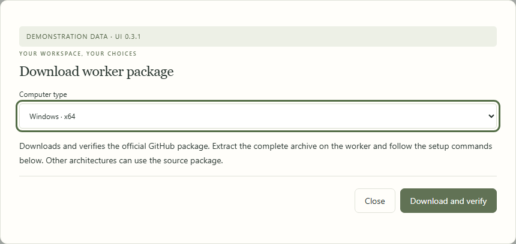

# Desktop preview

Local Control can run without a separate Python installation using an **unsigned, portable preview**. It is not a signed installer or a general-availability release. Model weights, Ollama, llmfit and Codex CLI are installed separately.

## Get a build

Download a versioned package from [GitHub Releases](https://github.com/thierry-gilgen-ict/ai-constitution/releases/latest). Choose `ai-constitution-worker-<os>-<architecture>.zip` for your machine and verify its SHA-256 against `SHA256SUMS.txt` or the adjacent `.zip.sha256` file. The package can run either the dashboard controller or a worker. The release notes identify the tested revision and limitations. Checksums verify bytes, not publisher identity.

For unreleased builds, the [Package Local Control preview workflow](https://github.com/thierry-gilgen-ict/ai-constitution/actions/workflows/package-preview.yml) builds on Windows, macOS and Linux. A successful run provides an artifact for each runner OS/architecture. Download only a run from a revision you intend to trust. GitHub may require sign-in for workflow artifacts; artifacts expire after seven days. The artifact contains a portable worker ZIP as well as unpacked build files: use the inner `ai-constitution-worker-*.zip` for dashboard registration and transfer. Release assets do not have this workflow-artifact expiry.

Extract the whole portable ZIP and retain its `licenses`, `dependencies.json` and `manifest.json` files. Match its architecture to the target computer; a successful build on one runner architecture does not establish compatibility with every CPU or GPU.

Run `app/ai-constitution-local/ai-constitution-local.exe` on Windows, or `app/ai-constitution-local/ai-constitution-local` on macOS/Linux. Running with no arguments starts a per-user background controller and opens its dashboard. Keep the full application directory together. The macOS output is a command-line executable, not a notarized `.app` bundle. Do not bypass operating-system security warnings; source execution remains available.

The same commands work in source and packaged form:

```sh
ai-constitution-local start --open
ai-constitution-local status
ai-constitution-local tray
ai-constitution-local autostart enable
ai-constitution-local autostart disable
ai-constitution-local stop --acknowledge-external-clients
```

`tray` runs separately from the controller. Quitting the tray leaves coding sessions running. Login startup is opt-in: Windows uses a current-user Run entry; macOS uses a user LaunchAgent. It starts the controller at the next login, not a persistent background updater. Linux uses the foreground/background CLI without an autostart helper.

## Build locally

Build on the target OS using a clean Python 3.11+ virtual environment:

```sh
python -m venv .local/build-env
# Activate that environment using your shell's normal activation command.
python -m pip install -r requirements-build.txt
python scripts/package_local.py --output .local/package
```

The script produces an app directory, dependency inventory, license files and a SHA-256 file manifest. It smoke-tests the frozen entry point. The manifest detects changed bytes; it is not publisher authentication. Build logs, temporary spec files and build caches are not release assets. Dependencies for desktop/build features are pinned separately from the dependency-free core.

## Upgrade or remove

Close managed coding sessions before replacing the controller application. Use Gaming mode to free the GPU while sessions stay open; that does not make an application restart seamless. Stop reports active responses, queued work, jobs and managed sessions rather than terminating them. Unknown external clients require explicit acknowledgement.

Disable login startup, stop the controller, extract the new app into a separate versioned directory, then start it with the same private state directory. Enable startup again if desired. Keep the old version until verification passes. Configuration schema 1 is backed up privately before migrating to schema 2; interrupted jobs are recorded and never replayed automatically. Do not restore an old config over new credentials or subsequent edits.

For removal, disable startup and stop the controller before removing its portable app directory. Private state and model weights remain available; this operation does not erase user data. The constitution library's `upgrade` command manages instruction releases independently of companion binaries.

## Release gates

CI build success is not physical inference certification. Signed Windows installers, notarized macOS app bundles, physical Mac/AMD/Intel/ARM inference coverage, multi-computer soak tests and external first-run usability checks remain required before a broad desktop release. No signing identity or certificate is stored in this repository.

<!-- screenshots:packages:begin -->

**In the dashboard · Get a verified worker package.** Choose Windows x64, Apple Silicon or Linux x64. Source packages support other compatible environments.



[Illustrated walkthrough](manual/workers.md) · Fictional data; UI 0.3.1.

<!-- screenshots:packages:end -->
