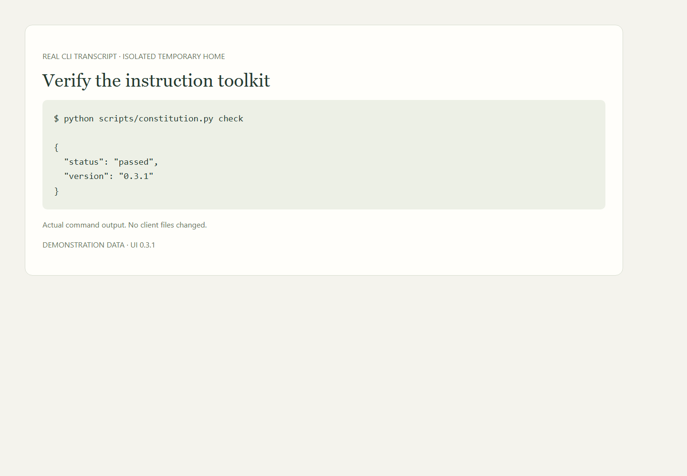

# Getting started

## Install once

Clone the repository wherever you keep development projects. Python 3.11+ and Git are the only prerequisites. The Python entry point works on Windows, macOS, and Linux; the PowerShell wrapper forwards identical arguments.

```sh
python scripts/constitution.py check
python scripts/constitution.py install --dry-run
python scripts/constitution.py install
python scripts/constitution.py doctor
```

Choose one client with `install --platform codex` or `install --platform cursor`.

Default destinations:

| Destination | Contents |
| --- | --- |
| `~/.codex/AGENTS.md` | A managed block containing the core and library location |
| `~/.cursor/rules/ai-constitution.mdc` | Global file-based Cursor rule |
| `~/.codex/skills/constitution-*` | Onboarding and maintenance skills |
| `~/.cursor/skills/constitution-*` | The same portable skills |
| `~/.config/ai-constitution/libraries/<client>/` | Rendered modules and source-checkout pointer |
| `~/.config/ai-constitution/state/` | Private enrollment, transaction backups, and observations |

The source checkout is not copied into `.config`. Runtime copies are generated from it. Use `AI_CONSTITUTION_STATE_DIR` or the global `--state-dir <directory>` option to relocate private state. Put global options **before** the command.

`--home <directory>` is available on `install` for a sandboxed trial. It does not change the real home directory or a shell profile. Custom `CODEX_HOME` layouts currently use the manual exported adapter; the installer refuses an ambiguous layout rather than writing into the wrong profile.

If your `.cursor` directory is a junction or symlink to a relocated profile, first inspect its destination. Pass that real, existing configuration directory explicitly with `install --platform cursor --cursor-dir /real/cursor/configuration`. The installer records the selected location privately, so later `sync` and `doctor` commands work without repeating it. The normal rule against writing through links still applies. Instruction libraries stay under `.config`.

<!-- screenshots:check:begin -->

**In the dashboard · Verify the instruction toolkit.** A rendered transcript of a real isolated CLI check. This image is not a screenshot of a terminal application.



[Illustrated walkthrough](manual/toolkit.md) · Fictional data; UI 0.3.1.

<!-- screenshots:check:end -->

## Confirm activation

Restart or start a fresh agent session. Ask it to identify its active constitution version and instruction sources. File installation is deterministic; actual instruction loading depends on the client. Follow [acceptance.md](../checks/acceptance.md).

Cursor also supports account-synced User Rules through its UI. If your installed client does not load the global file rule, paste `adapters/cursor/user-rules.md` into Customize → Rules and verify it there. Do not activate duplicate copies unnecessarily. User Rules do not govern Tab or Inline Edit. [Official Cursor rules](https://cursor.com/help/customization/rules).

Codex can load a global `AGENTS.override.md` in place of `AGENTS.md`. The installer detects a nonempty override and stops before changing files. Resolve that scope intentionally. [Official Codex discovery](https://learn.chatgpt.com/docs/agent-configuration/agents-md).

## Onboard a project

```sh
python scripts/constitution.py onboard --project /path/to/project --dry-run
python scripts/constitution.py onboard --project /path/to/project
python scripts/constitution.py doctor --project /path/to/project
```

The project receives an additive managed section in `AGENTS.md`, `.ai/shared/`, `.ai/project.md`, and `.ai/constitution.lock.json`. Existing `.ai/project.md` is retained and never synchronized over. Fill it with the [agent prompt](../onboarding/project.md).

Existing team and project rules keep their native precedence. Review conflicts; do not delete nested instructions simply to make onboarding pass. The tool checks byte-level drift, not the meaning of arbitrary instructions.

Use `onboard --pin` for a project that must stay on its installed version. `sync --all` skips pinned targets. An explicit `sync --all --include-pinned` updates them while retaining their pin for subsequent runs.

Commit the portable project files only if appropriate for that repository. They contain no machine paths. Project context may itself be private: review it under that project's publication policy.

<!-- screenshots:onboard:begin -->

**In the dashboard · Review enrollment.** The enrollment preview lists proposed managed-file changes. Only ready repositories are enrolled when you apply.


[Illustrated walkthrough](manual/projects.md) · Fictional data; UI 0.3.1.

<!-- screenshots:onboard:end -->

## Grok Bots

Use [Bot onboarding](../onboarding/bot.md). `export --output dist/grok-bot.zip` makes a small, allowlisted instruction bundle. Uploading it and enrolling the Bot are separate, visible steps.
