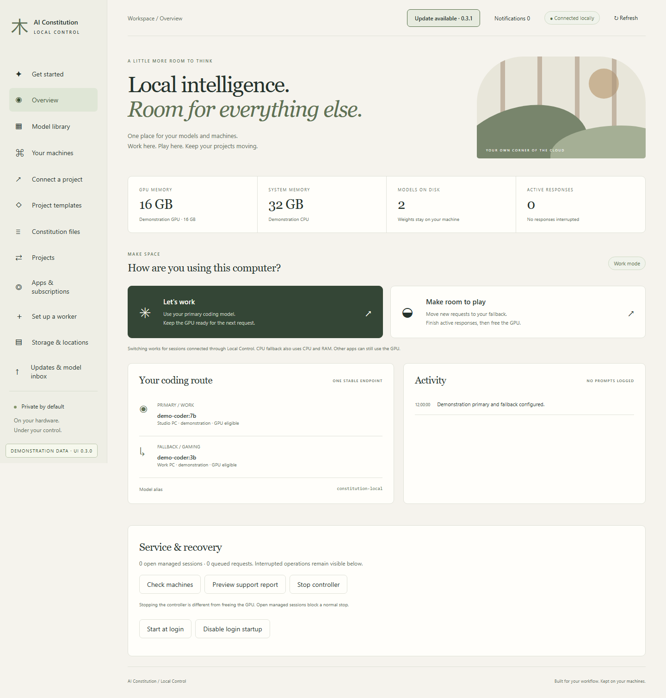
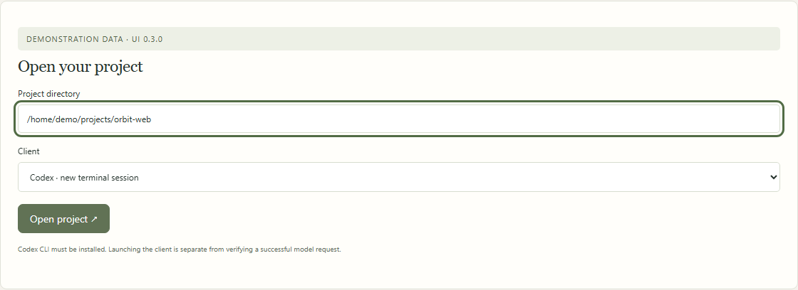
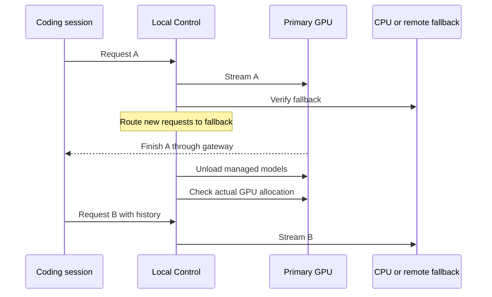
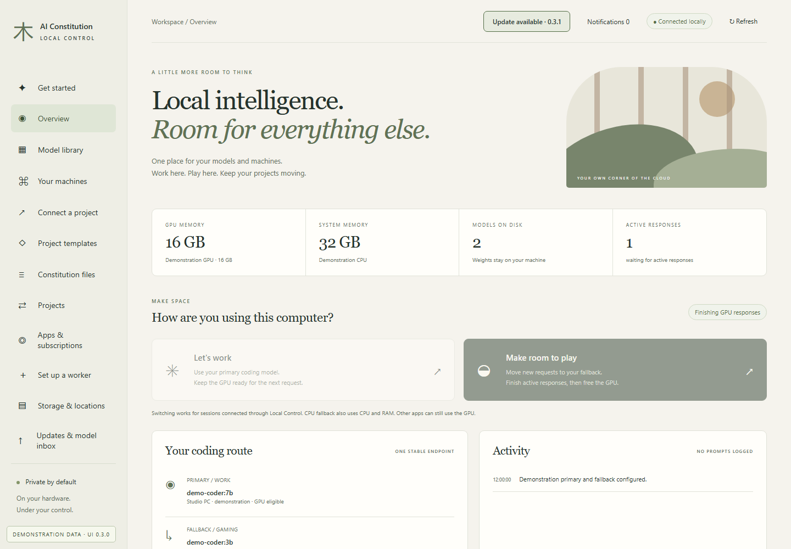
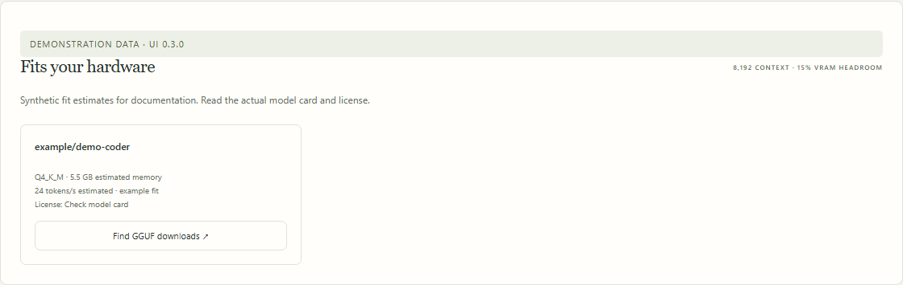

# Local Control

**Your models, your machines, one coding endpoint.** An optional companion to AI Constitution for Ollama model management, hardware recommendations and GPU release without interrupting active gateway responses.

Local Control is a **preview**. The controller, dashboard and gateway use Python's standard library. Remote HTTPS workers additionally use `cryptography`. You can continue using the constitution alone without running any services.

The dashboard also includes [Project templates](project-templates.md) for reusable architecture baselines and [Constitution files](constitution-studio.md) for private instruction editing. These pages work without a running model. Draft saves and project applications are explicit; visiting the pages does not activate changes.

## Start here

From this checkout, with Python 3.11+ installed:

```sh
python scripts/local_control.py setup --ollama --llmfit
python scripts/local_control.py doctor
python scripts/local_control.py start --open
```

Start the Ollama application if doctor reports it offline. Windows installation uses the official winget package; macOS uses Homebrew's Ollama cask. Linux users install Ollama from its official download page. An existing installation is reused. Package managers may show their normal installation prompts.

The dashboard opens at `http://127.0.0.1:8766`. The launch link signs you in; its secret is removed from the address bar immediately. To reopen an already running dashboard:

```sh
python scripts/local_control.py open
```

1. Open **Get started** for guided runtime, context and route setup. In **Model library**, Use an installed tool-capable model, or choose **Find models for my hardware**.
2. Choose **Use in project → Primary**. This creates an alias using existing weights and your chosen context (64K by default), then tests a function call, valid arguments, full-history tool-result replay, resident context capacity and CPU placement where relevant.
3. Set a **Fallback** on another machine, or select **Run on CPU** for this computer. CPU setup starts a separate loopback Ollama process on port 11435 and reuses the active model store. It verifies actual GPU allocation after loading.
4. Start a project through a launcher below. Use **Make room to play** to switch new requests and drain the GPU.

Before configuring routes, **Suggest a starting context** offers a conservative hardware-based starting point. It does not establish that a particular model or KV cache fits; use the model-fit estimate and route checks. Context changes are explicit and locked once routes are configured.

Creating a route never implicitly downloads a missing base model. Downloading and updating weights is an explicit action. Aliases share their base weights; inventory sizes are not additive disk requirements.

You can configure a CPU or eligible remote fallback while Gaming mode stays on. The current route remains selected until the new model passes the protocol checks; the primary GPU stays protected. Wait for active responses before configuring, and leave maintenance on the target machine first. Earlier fallbacks, including those created before the alternatives list was introduced, remain available after adding another one. No configuration migration is needed for this update.

<!-- screenshots:overview:begin -->

**In the dashboard · Overview.** Open Overview from the sidebar. The page below uses fictional documentation data.



[Illustrated walkthrough](manual/overview.md) · Fictional data; UI 0.3.0.

<!-- screenshots:overview:end -->

## Codex and Cursor

```sh
python scripts/local_control.py codex --project /path/to/project
python scripts/local_control.py cursor --project /path/to/project
```

The Codex launcher uses session-specific provider and model metadata, derived from the installed CLI's catalog schema. It keeps existing filesystem permissions, approvals, project instructions and normal Codex configuration. The session disables bundled plugins, apps, multi-agent mode and web search to keep local context manageable. Existing client tools can still make network requests under the client's usual policies; this is a local inference route, not an OS network sandbox.

Cursor opens a private `.code-workspace` file with **Terminal → Run Task → AI Constitution: Local Codex**. Existing project settings and tasks are preserved. The local coding agent runs inside Cursor's terminal. **Cursor's native Agent and Tab are not replaced.** Cursor's BYOK requests still pass through its backend; a private localhost service is not a fully local native Agent integration. No public tunnel is created. [Cursor API-key behavior](https://cursor.com/help/models-and-usage/api-keys).

For automation, pass Codex arguments after `--`:

```sh
python scripts/local_control.py codex --project /path/to/project -- exec "Explain the test command"
```

The launcher needs a Codex CLI with `debug models --bundled`. Custom gateway aliases need matching model metadata; configuration is applied at session startup. [Official gateway guidance](https://learn.chatgpt.com/docs/enterprise/roll-out-a-gateway). Ollama's own direct Codex integration remains an alternative when switching is unnecessary. [Ollama integration](https://docs.ollama.com/integrations/codex).

<!-- screenshots:connect:begin -->

**In the dashboard · Open a local Codex session.** Select the project directory and client. The launcher starts a new session; it does not migrate a running direct-provider session.



[Illustrated walkthrough](manual/connect.md) · Fictional data; UI 0.3.0.

<!-- screenshots:connect:end -->

## What Gaming mode guarantees



- A healthy fallback is required before the route changes. A failed probe leaves the original route in place.
- Active responses finish where they began. Their live cache is not migrated. New requests carry their conversation history to the selected model.
- Server-side `previous_response_id` and conversation references are refused: those identifiers cannot be carried safely between independent servers.
- Once a stream starts, it is never automatically replayed against another model. Network loss is reported to the client; it is not disguised as uninterrupted success.
- Only managed GPU models are unloaded. Other apps, directly connected sessions, and unmanaged Ollama models can still consume GPU memory. The dashboard reports remaining models.
- Existing sessions connected directly to a provider cannot be moved into the gateway midway through a task. Start through the launcher to enable switching.

CPU fallback uses RAM and CPU time and can affect game performance. A second computer is the best option when you want the gaming computer's CPU free too. Switching to a different model can change reasoning quality and tool behavior even if transport succeeds.

<!-- screenshots:gaming:begin -->

**In the dashboard · Wait for the current response.** A transition waits for the response already using the GPU. The next request can then use the fallback.



[Illustrated walkthrough](manual/overview.md) · Fictional data; UI 0.3.0.

<!-- screenshots:gaming:end -->

## Choose models using evidence

The hardware helper is [llmfit](https://github.com/AlexsJones/llmfit). It estimates quantization, context memory and throughput from detected hardware. Suggestions reserve 15% of reported VRAM, require advertised tool use and the selected session context, and retain candidates with an Ollama tag or a GGUF source. These are **predictions, not measured coding scores**. A very low-bit quantization that fits may still be a poor coding choice.

Hugging Face browsing shows model cards, license metadata, GGUF filenames and available sizes. Select a file, review it, and click **Download / update**. Ollama accepts `hf.co/owner/repository:filename.gguf` for supported GGUF architectures. Gated repositories need publisher access; there is no token-entry or access-bypass flow in this preview. [Hugging Face integration](https://huggingface.co/docs/hub/ollama).

An advertised tool capability and a successful text response do not establish reliable agent performance. Try a disposable project and verify actual tool execution before adopting a model for important work.

<!-- screenshots:fit:begin -->

**In the dashboard · Find models for your hardware.** Choose Find models for my hardware. Estimated fit is shown separately from measured results.



[Illustrated walkthrough](manual/models.md) · Fictional data; UI 0.3.0.

<!-- screenshots:fit:end -->

## Add machines

For a second Windows PC, follow the [step-by-step Windows worker guide](windows-worker.md), including the scoped firewall rule and private pairing instructions.

On each Windows, macOS or Linux worker:

```sh
python scripts/local_control.py setup --ollama --llmfit
python -m pip install -r requirements-local-node.txt
python scripts/local_control.py node --address 192.168.1.50
```

In another terminal on that worker:

```sh
python scripts/local_control.py pairing --address 192.168.1.50
```

Replace the example IP with that computer's private IPv4 address. Paste the pairing JSON into **Your machines → Add a machine** on the controller. The record contains a single-use pairing code that expires after five minutes and a certificate fingerprint: transfer it privately and never commit it. Each paired controller receives separate management and inference credentials; the worker stores their hashes. The controller verifies the certificate pin before sending credentials. Workers expose only the authenticated node API; Ollama itself stays on loopback.

Allow the selected worker port through that machine's firewall only for trusted home-network peers. The tool does not change firewall rules, scan the LAN, open router ports or install remote shells. Use separate state directories if one computer runs both a controller and a worker; each directory has its own credentials and process lock.

The cluster schedules **whole requests** to selected machines. It does not combine VRAM, shard weights or implement distributed tensor inference. The preview has one controller and explicit primary/fallback routes. Configuring another fallback retains earlier alternatives; Gaming mode tries eligible alternatives in order before switching. Machines exposes a saved remote-first preference and per-machine Gaming eligibility. Explicit health checks retain a bounded private history; a recently observed offline route is blocked for 15 seconds before dispatch unless a new health check confirms recovery. Requests have a bounded queue and per-machine concurrency limit. Queued requests can be cancelled from Activity before inference is sent; an accepted generation is never cancelled through that control. Automatic failover after a generation begins, controller high availability, per-user quotas and unattended fleet-wide software rollout are not provided. Remote model inventory, loading, unloading and downloads are available now.

## Updating without surprises

| What changed | Command or control |
| --- | --- |
| Provider model definitions | `python scripts/constitution.py update` |
| New Hugging Face models for hardware matching | `python scripts/local_control.py refresh` |
| Installed model weights | **Download / update** the same tag on the selected machine |
| Ollama runtime | `python scripts/local_control.py setup --upgrade-ollama` |
| Display drivers | **Your machines → Check Windows updates / Update drivers**; confirm installation on that computer, then **Recheck & resume model use** |
| Reviewed llmfit binary | Update this checkout, then `python scripts/local_control.py setup --llmfit` |
| Companion code | Close managed sessions, safely stop the controller, update source or portable package, run checks, restart |

Model-data refresh does not download model weights. `llmfit update` stores its own metadata cache in a platform-specific data directory; `llmfit update --status` reports its location and age. Model pulls retain resumable partial downloads. Software updates are explicit; never update an inference runtime while relying on an active response to continue.

`local_control/setup.py` pins the reviewed llmfit release and per-platform archive SHA-256 digests. To support a newer binary, review its official release, update that manifest, run the tests and confirm its JSON CLI contract. No application rebuild is needed for model-data refreshes.

After an Ollama update, re-test both routes and Gaming mode. CPU placement options are runtime dependent; Local Control refuses a CPU route that actually uses GPU memory. Runtime rollback remains the package manager's responsibility.

## Private state, stopping and recovery

State defaults to `~/.config/ai-constitution/local-control/`; override it using `--state-dir` before the command or `AI_CONSTITUTION_LOCAL_HOME`. Credentials, machine addresses, model paths, client catalogs and generated workspaces stay there. The repository contains no machine inventory or pairing credentials.

The dashboard binds only to loopback and requires authentication. Browser requests receive same-origin checks and a strict cookie. The gateway supports `/v1/responses` and `/v1/chat/completions` with model `constitution-local` and bearer authentication. It does not record prompts or completions. Codex and Ollama may keep their own normal logs.

Use **Stop controller** or `stop --acknowledge-external-clients` after closing managed coding sessions. The new launcher tracks the client process between requests, so an idle but open session blocks a normal stop. Active responses, queued requests and pending operations also block it. Ctrl+C follows the same checks; a forced OS termination cannot be protected. Direct clients are not discoverable and require acknowledgement. Gaming mode frees GPU memory while keeping the gateway available.

A local CPU runtime remains available when the controller stops. New process records include executable/start identity, preventing PID reuse from being mistaken for ownership. Older CPU records can be reused read-only but are never grounds for terminating a process. Restart preserves Gaming mode. Schema migration saves the old configuration privately, and unfinished jobs become interrupted entries; downloads can be explicitly retried to reuse Ollama's existing chunks. Queued operations and active downloads expose cancellation where safe.

Pairing codes expire and work once. **Your machines** provides credential rotation and revoke/remove for reachable workers. On the worker, `controllers --address PRIVATE_IP` lists controller IDs; use `--revoke ID` to revoke one. Migrated workers retain legacy-token compatibility until you re-pair controllers and run `controllers --address PRIVATE_IP --disable-legacy`. New workers disable legacy access by default. Rotation invalidates old credentials for new requests; existing streams finish. If a reply or local save is lost, revoke the visible controller entry on the worker and re-pair explicitly. Offline removal cannot honestly claim worker revocation.

For login startup, tray controls and portable builds, see [Desktop preview](desktop-preview.md).

## Maintenance and measured results

**Your machines → Display drivers** reads installed graphics and virtual-display drivers on the controller and each updated worker. The CPU runtime shares the main computer's drivers. Windows can query applicable display-driver offers; macOS reports its bundled OS version/build, and Linux reports bound kernel/module or NVIDIA versions. Driver update handoff uses fixed OS/vendor controls on the selected computer, with no arbitrary remote commands or automatic reboot. See [driver maintenance](driver-maintenance.md) for the workflow, platform limits, recovery and worker upgrades.

**Your machines → Drain for maintenance** verifies another eligible route when needed, redirects new requests, waits for existing responses, and unloads only owned models. Maintenance exclusions persist across restarts. Leaving maintenance checks that the runtime responds; selecting it for work revalidates stale compatibility evidence. External clients can still load models and are reported separately.

Worker metadata reads have a ten-second upstream timeout and do not wait behind downloads or lifecycle operations. This keeps health checks available when another operation is slow; a stalled Ollama process can still fail its own health check. Existing portable workers need an updated package and a restart to receive this change. Drain them first; replacing only the controller does not update remote worker code.

**Upgrade local Ollama** requires both local runtimes to be drained and a compatible remote route to remain available. It invokes the computer's official package manager; it does not run remote shell commands. Update each remote computer from that computer, then check its runtime and return it to service. Package-manager updates can require interactive prompts or an Ollama restart; rollback is vendor/package-manager specific. With only one computer, finish sessions before updating the runtime manually.

**Connect a project → Evaluate** runs a bounded, opt-in protocol check and a small coding fixture. It asks for a single clamp-function patch and checks eight cases using a restricted AST interpreter: generated Python is never executed. Results include digest, quantization, context, runtime, first-text latency, output tokens over total request time and post-request residency. A 500 ms sampler records peak observed Ollama model/GPU residency. It can miss brief peaks and excludes driver, OS and other-model allocations; it is not an allocator-level peak-memory measurement. Close managed sessions first. A changed digest or runtime marks earlier results stale. A passing fixture is useful evidence, not a general coding-quality score.

**Overview → Preview support report** shows an allowlisted report before download. It excludes credentials, addresses, host/project paths, names, prompts, responses and raw logs. There is no automatic upload or telemetry. The core `constitution.py explain --project PATH --json` separately reports instruction provenance and drift; installing a file is not evidence that a client loaded it.

## Compatibility and verification

| Surface | Support level |
| --- | --- |
| Windows + NVIDIA | Live tested with Ollama 0.34.4, a 24 GB RTX 4090 and gpt-oss:20b |
| Codex CLI | Live Responses and shell-tool checks with 0.159.2; session metadata generated from the installed CLI |
| Cursor | Private workspace/task integration; native Agent replacement is not offered |
| macOS Intel / Apple Silicon | Portable Python, Homebrew install and pinned helper binaries; physical Mac inference validation still needed |
| Linux x86_64 / ARM64 | Portable controller/worker and helper binaries; Ollama installation follows its official instructions |
| Windows ARM64 | Pinned helper binary; physical inference validation still needed |
| AMD / Intel GPU | Windows RX 580 (8 GB), Ollama 0.35.0 and Qwen 3.5 4B passed short GPU-residency and 64K function-call/history checks, but the operator reported a PC crash during the subsequent client test. This combination is not qualified for routine use; the cause is not isolated |
| Remote workers | Two physical Windows machines passed pinned pairing, download and protocol checks; a live drain moved new requests to CPU while retaining the existing remote lease. Multi-computer soak testing still needed |

Automated tests cover authentication, origin checks, request streaming, model leases, failed fallback checks, drain-before-unload, interrupted client cleanup and restart behavior. Live testing on the reference Windows machine verified an active stream finishing, the next request using CPU, zero managed GPU allocation afterward, and a real Codex shell command on the CPU fallback.

The small AMD-worker model did not finish the default coding fixture within its 1,024-output-token budget, and a real Codex smoke test exceeded five minutes before its first tool call. The operator subsequently reported a PC crash; later metadata and non-thinking requests timed out. The worker was left in maintenance and excluded from Gaming selection, with the proven CPU fallback retained. The crash cause requires local diagnosis; it is not attributed to a specific model, driver or application. These failures are retained as qualification evidence: fitting in VRAM and passing a short tool probe do not establish useful coding performance or stability.
