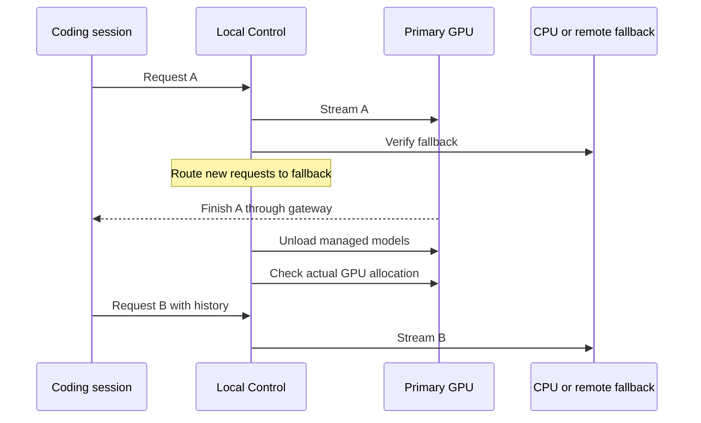

# Local Control

**Your models, your machines, one coding endpoint.** An optional companion to AI Constitution for Ollama model management, hardware recommendations and GPU release without interrupting active gateway responses.

Local Control is a **preview**. The controller, dashboard and gateway use Python's standard library. Remote HTTPS workers additionally use `cryptography`. You can continue using the constitution alone without running any services.

## Start here

From this checkout, with Python 3.11+ installed:

```sh
python scripts/local_control.py setup --ollama --llmfit
python scripts/local_control.py doctor
python scripts/local_control.py serve --open
```

Start the Ollama application if doctor reports it offline. Windows installation uses the official winget package; macOS uses Homebrew's Ollama cask. Linux users install Ollama from its official download page. An existing installation is reused. Package managers may show their normal installation prompts.

The dashboard opens at `http://127.0.0.1:8766`. The launch link signs you in; its secret is removed from the address bar immediately. To reopen an already running dashboard:

```sh
python scripts/local_control.py open
```

1. Open **Model library**. Use an installed tool-capable model, or choose **Find models for my hardware**.
2. Choose **Use in project → Primary**. This creates a 64K-context alias using existing weights, checks tool metadata, and makes a small local Responses API request.
3. Set a **Fallback** on another machine, or select **Run on CPU** for this computer. CPU setup starts a separate loopback Ollama process on port 11435 and reuses the active model store. It verifies actual GPU allocation after loading.
4. Start a project through a launcher below. Use **Make room to play** to switch new requests and drain the GPU.

Creating a route never implicitly downloads a missing base model. Downloading and updating weights is an explicit action. Aliases share their base weights; inventory sizes are not additive disk requirements.

## Codex and Cursor

```sh
python scripts/local_control.py codex --project /path/to/project
python scripts/local_control.py cursor --project /path/to/project
```

The Codex launcher uses session-specific provider and model metadata, derived from the installed CLI's catalog schema. It keeps existing filesystem permissions, approvals, project instructions and normal Codex configuration. The session disables bundled plugins, apps, multi-agent mode and web search to keep local context manageable. Existing client tools can still make network requests under the client's usual policies; this is a local inference route, not an OS network sandbox.

Cursor opens a private `.code-workspace` file with **Terminal → Run Task → AI Constitution: Local Codex**. Existing project settings and tasks are preserved. The local coding agent runs inside Cursor's terminal. **Cursor's native Agent and Tab are not replaced.** Cursor's BYOK requests still pass through its backend; a private localhost service is not a fully local native Agent integration. No public tunnel is created. [Cursor API-key behavior](https://cursor.com/help/models-and-usage/api-keys).

For automation, pass Codex arguments after `--`:

```sh
python scripts/local_control.py codex --project /path/to/project -- exec "Explain the test command"
```

The launcher needs a Codex CLI with `debug models --bundled`. Custom gateway aliases need matching model metadata; configuration is applied at session startup. [Official gateway guidance](https://learn.chatgpt.com/docs/enterprise/roll-out-a-gateway). Ollama's own direct Codex integration remains an alternative when switching is unnecessary. [Ollama integration](https://docs.ollama.com/integrations/codex).

## What Gaming mode guarantees



- A healthy fallback is required before the route changes. A failed probe leaves the original route in place.
- Active responses finish where they began. Their live cache is not migrated. New requests carry their conversation history to the selected model.
- Server-side `previous_response_id` and conversation references are refused: those identifiers cannot be carried safely between independent servers.
- Once a stream starts, it is never automatically replayed against another model. Network loss is reported to the client; it is not disguised as uninterrupted success.
- Only managed GPU models are unloaded. Other apps, directly connected sessions, and unmanaged Ollama models can still consume GPU memory. The dashboard reports remaining models.
- Existing sessions connected directly to a provider cannot be moved into the gateway midway through a task. Start through the launcher to enable switching.

CPU fallback uses RAM and CPU time and can affect game performance. A second computer is the best option when you want the gaming computer's CPU free too. Switching to a different model can change reasoning quality and tool behavior even if transport succeeds.

## Choose models using evidence

The hardware helper is [llmfit](https://github.com/AlexsJones/llmfit). It estimates quantization, context memory and throughput from detected hardware. Suggestions reserve 15% of reported VRAM, require advertised tool use and 64K context, and retain candidates with an Ollama tag or a GGUF source. These are **predictions, not measured coding scores**. A very low-bit quantization that fits may still be a poor coding choice.

Hugging Face browsing shows model cards, license metadata, GGUF filenames and available sizes. Select a file, review it, and click **Download / update**. Ollama accepts `hf.co/owner/repository:filename.gguf` for supported GGUF architectures. Gated repositories need publisher access; there is no token-entry or access-bypass flow in this preview. [Hugging Face integration](https://huggingface.co/docs/hub/ollama).

An advertised tool capability and a successful text response do not establish reliable agent performance. Try a disposable project and verify actual tool execution before adopting a model for important work.

## Add machines

On each Windows, macOS or Linux worker:

```sh
python scripts/local_control.py setup --ollama --llmfit
python -m pip install -r requirements-local-node.txt
python scripts/local_control.py node --address 192.168.1.50
```

In another terminal on that worker:

```sh
python scripts/local_control.py pairing --address 192.168.1.50
```

Replace the example IP with that computer's private IPv4 address. Paste the pairing JSON into **Your machines → Add a machine** on the controller. The record contains a bearer credential and certificate fingerprint: transfer it privately and never commit it. The controller verifies the certificate pin before sending credentials. Workers expose only the authenticated node API; Ollama itself stays on loopback.

Allow the selected worker port through that machine's firewall only for trusted home-network peers. The tool does not change firewall rules, scan the LAN, open router ports or install remote shells. Use separate state directories if one computer runs both a controller and a worker; each directory has its own credentials and process lock.

The cluster schedules **whole requests** to selected machines. It does not combine VRAM, shard weights or implement distributed tensor inference. The preview has one controller and explicit primary/fallback routes; controller high availability, automatic failover, per-user quotas and fleet-wide software rollout are future work. Remote model inventory, loading, unloading and downloads are available now.

## Updating without surprises

| What changed | Command or control |
| --- | --- |
| Provider model definitions | `python scripts/constitution.py update` |
| New Hugging Face models for hardware matching | `python scripts/local_control.py refresh` |
| Installed model weights | **Download / update** the same tag on the selected machine |
| Ollama runtime | `python scripts/local_control.py setup --upgrade-ollama` |
| Reviewed llmfit binary | Update this checkout, then `python scripts/local_control.py setup --llmfit` |
| Companion code | Stop the controller after requests finish, update the checkout, run checks, restart it |

Model-data refresh does not download model weights. `llmfit update` stores its own metadata cache in a platform-specific data directory; `llmfit update --status` reports its location and age. Model pulls retain resumable partial downloads. Software updates are explicit; never update an inference runtime while relying on an active response to continue.

`local_control/setup.py` pins the reviewed llmfit release and per-platform archive SHA-256 digests. To support a newer binary, review its official release, update that manifest, run the tests and confirm its JSON CLI contract. No application rebuild is needed for model-data refreshes.

After an Ollama update, re-test both routes and Gaming mode. CPU placement options are runtime dependent; Local Control refuses a CPU route that actually uses GPU memory. Runtime rollback remains the package manager's responsibility.

## Private state, stopping and recovery

State defaults to `~/.config/ai-constitution/local-control/`; override it using `--state-dir` before the command or `AI_CONSTITUTION_LOCAL_HOME`. Credentials, machine addresses, model paths, client catalogs and generated workspaces stay there. The repository contains no machine inventory or pairing credentials.

The dashboard binds only to loopback and requires authentication. Browser requests receive same-origin checks and a strict cookie. The gateway supports `/v1/responses` and `/v1/chat/completions` with model `constitution-local` and bearer authentication. It does not record prompts or completions. Codex and Ollama may keep their own normal logs.

Stop the controller with Ctrl+C in its terminal **after active requests finish**. Stopping it during a request interrupts that connection. A locally created CPU runtime remains available; its PID and URL are recorded in `cpu-runtime.json`. To reclaim its RAM, unload its model from Model library, then stop that recorded process if desired. On restart, Gaming mode remains routed to fallback, rather than silently loading the GPU. CPU runtime startup is restored when its saved configuration is present.

There is no operating-system autostart registration, tray app or background updater in this preview. Run `serve --open` when needed. Pairing revocation currently requires stopping the worker, removing its token from private configuration and generating a replacement through a fresh state directory; do not expose workers to untrusted networks.

## Compatibility and verification

| Surface | Support level |
| --- | --- |
| Windows + NVIDIA | Live tested with Ollama 0.34.4, a 24 GB RTX 4090 and gpt-oss:20b |
| Codex CLI | Live Responses and shell-tool checks with 0.159.2; session metadata generated from the installed CLI |
| Cursor | Private workspace/task integration; native Agent replacement is not offered |
| macOS Intel / Apple Silicon | Portable Python, Homebrew install and pinned helper binaries; physical Mac inference validation still needed |
| Linux x86_64 / ARM64 | Portable controller/worker and helper binaries; Ollama installation follows its official instructions |
| Windows ARM64 | Pinned helper binary; physical inference validation still needed |
| AMD / Intel GPU | Discovery depends on llmfit and runtime support; no blanket inference certification |
| Remote workers | Automated HTTPS, authentication and certificate-change tests; multi-computer soak testing still needed |

Automated tests cover authentication, origin checks, request streaming, model leases, failed fallback checks, drain-before-unload, interrupted client cleanup and restart behavior. Live testing on the reference Windows machine verified an active stream finishing, the next request using CPU, zero managed GPU allocation afterward, and a real Codex shell command on the CPU fallback.
