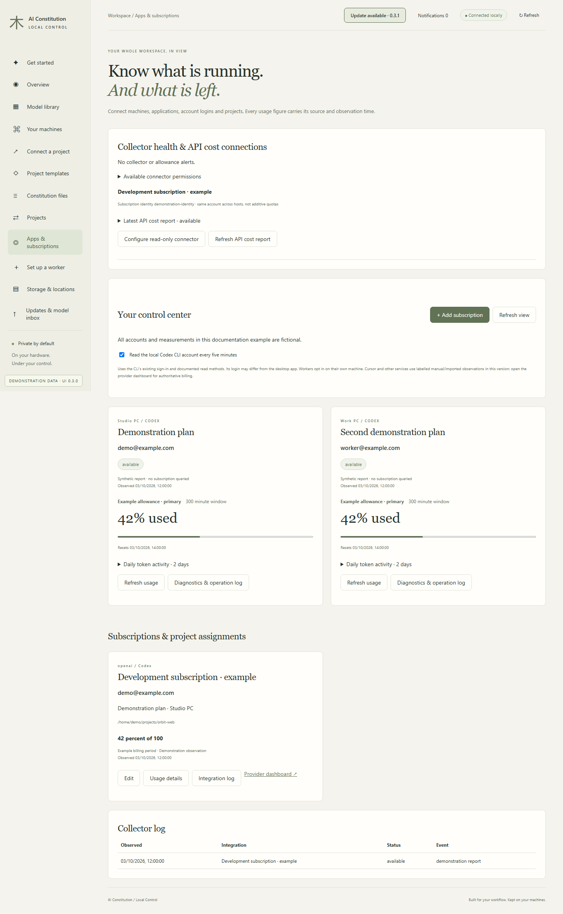
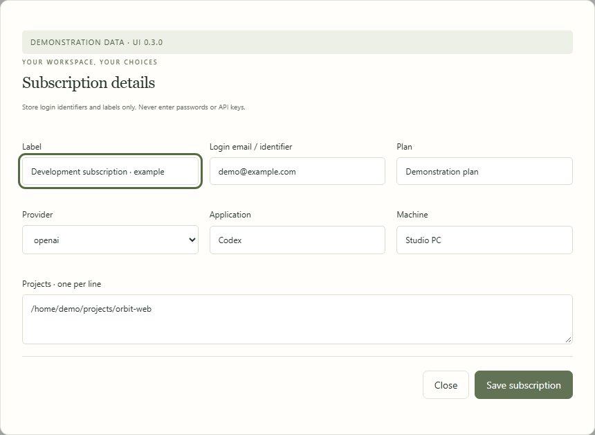
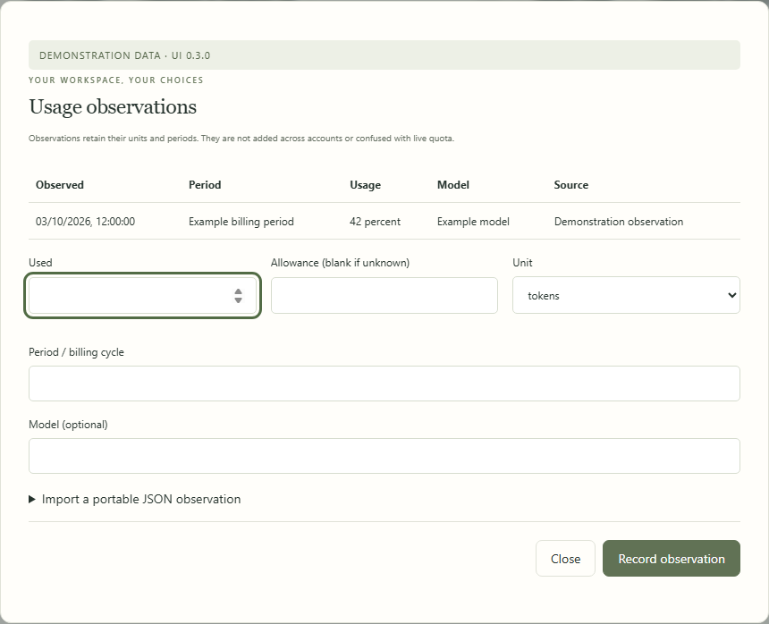
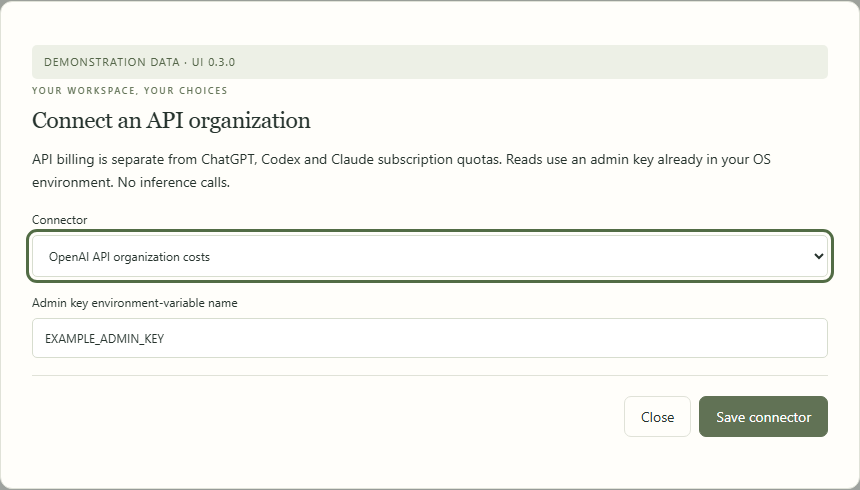
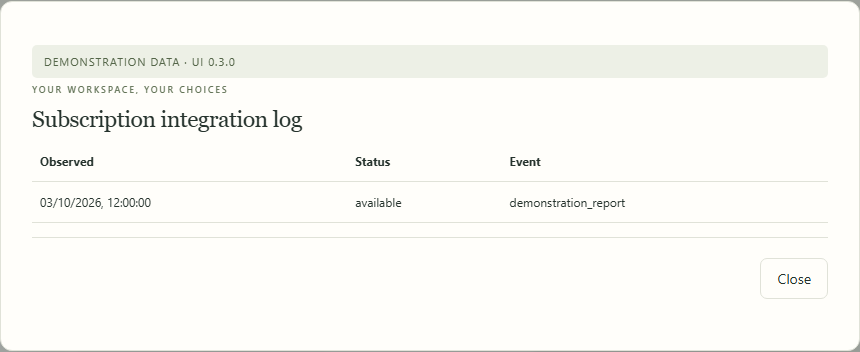
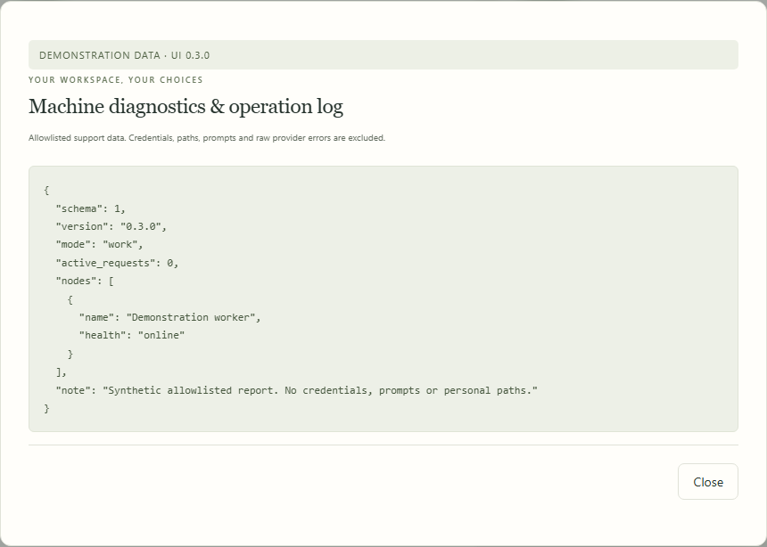
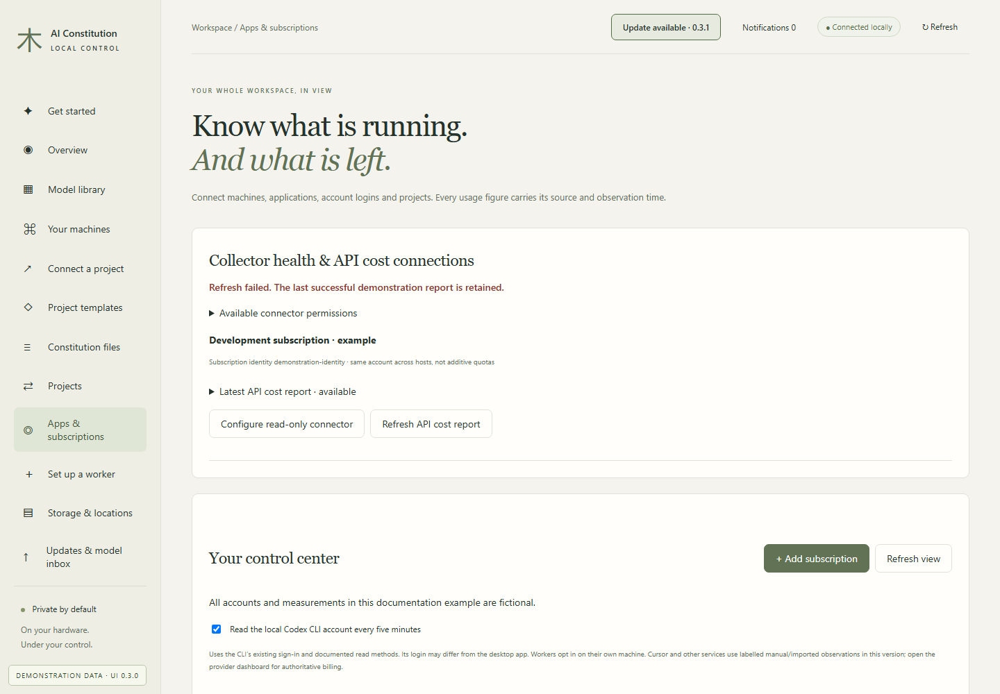

# Applications and subscriptions

[All workflows](README.md) · [Detailed instructions](../control-center.md)

Actual Local Control UI **0.3.0**, captured with fictional accounts, paths, models and usage. Performance numbers and update versions are examples, not benchmarks or release announcements. CLI images are rendered transcripts from real isolated commands. [How these images are made](../screenshot-maintenance.md).

## Apps & subscriptions

Open Apps & subscriptions from the sidebar. The page below uses fictional documentation data.

## Identify a subscription

Record the login identifier, provider, application, plan and machine. These fields identify the account without storing its password.

## Record a usage observation

Usage observations carry a unit, period, source and timestamp. They are separate from automatically collected quota windows.

## Configure read-only API costs

Select a supported organization connector and the name of an existing admin-key environment variable. Never paste the key itself.

## Inspect integration events

Integration logs show observation status and event codes for the selected subscription.

## Inspect worker diagnostics

Use Diagnostics & operation log for allowlisted support information. The example contains no credentials or conversation contents.

## Retain the last successful report

A failed refresh is visible while the previous successful report remains available with its observation time.

---

[Back to all workflows](README.md)
