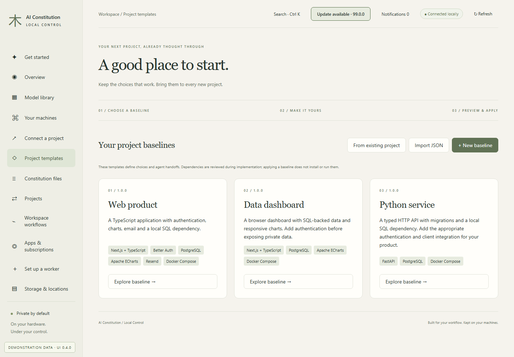
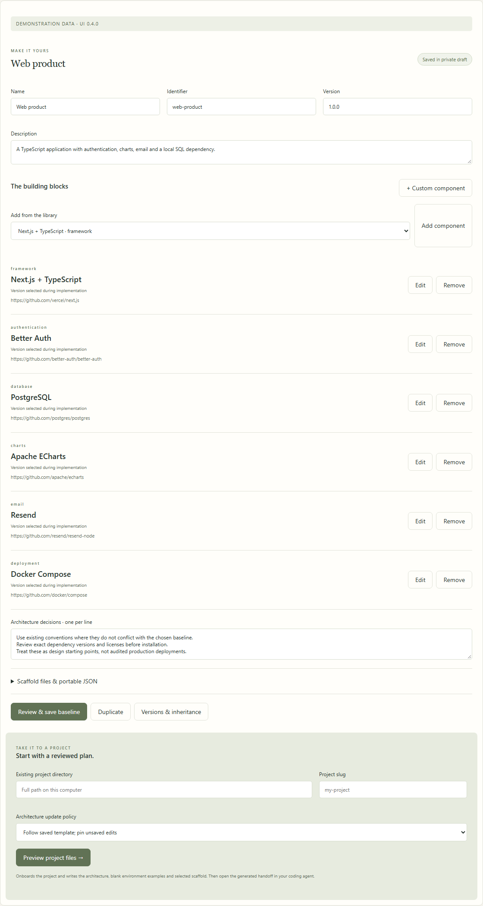
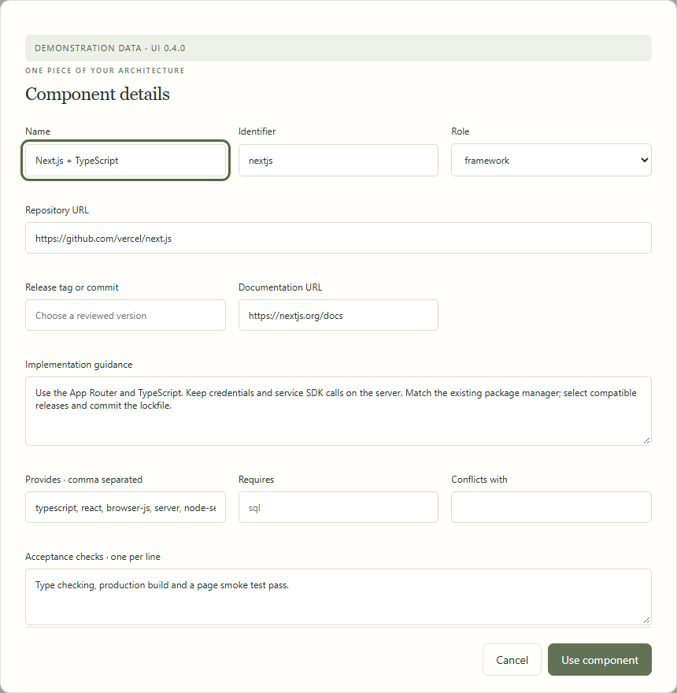
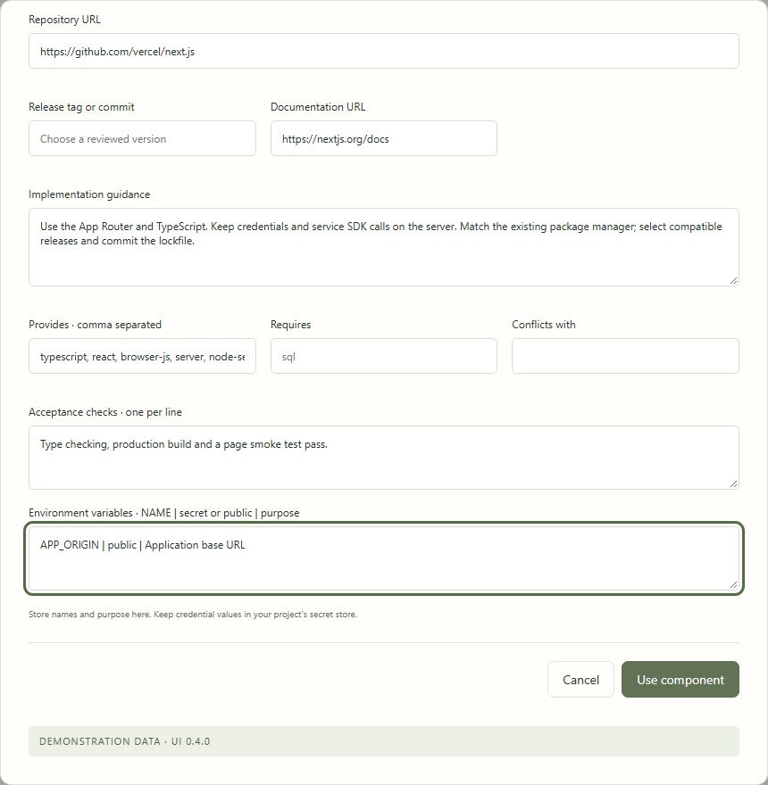
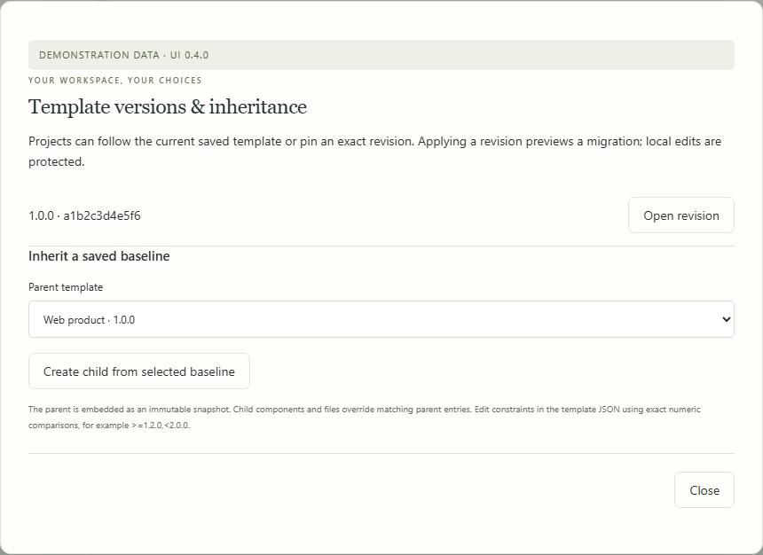
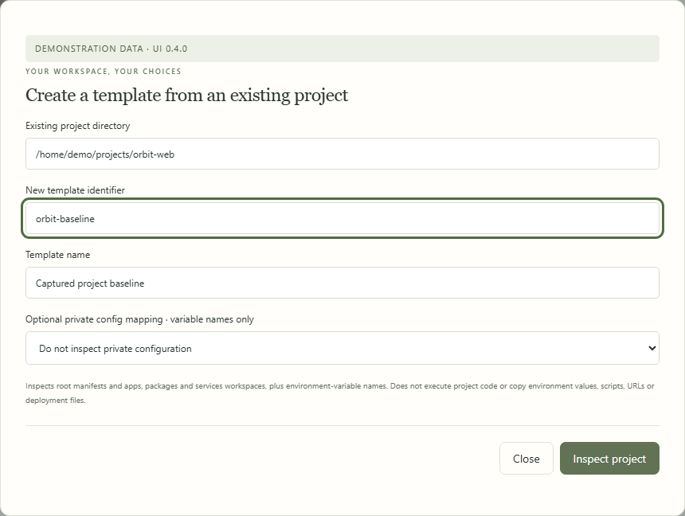
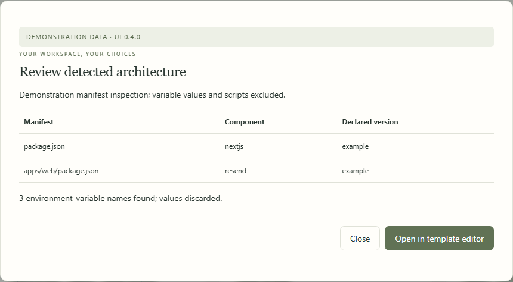
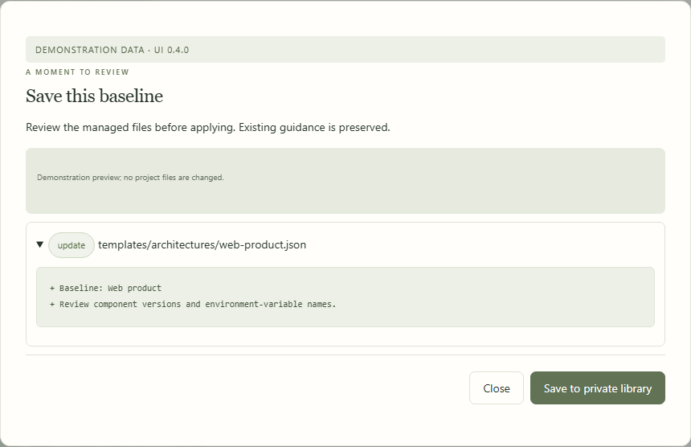
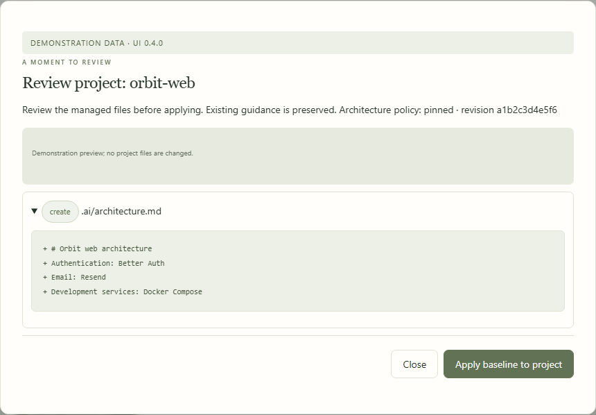

# Architecture templates

[All workflows](README.md) · [Detailed instructions](../project-templates.md)

Actual Local Control UI **0.4.0**, captured with fictional accounts, paths, models and usage. Performance numbers and update versions are examples, not benchmarks or release announcements. CLI images are rendered transcripts from real isolated commands. [How these images are made](../screenshot-maintenance.md).

## Project templates

Open Project templates from the sidebar. The page below uses fictional documentation data.

## Customize a baseline

Choose Explore baseline to edit its components and decisions. The selected web baseline includes authentication, charts, email and SQL services.

## Review a component

Each component records its repository, reviewed version, guidance and compatibility requirements.

## Declare environment names

Scroll through component details to enter acceptance checks and environment-variable names and purposes. Credential values belong in the private configuration store.

## Versions and inheritance

Open Versions & inheritance to inspect saved revisions or create a child of an immutable parent.

## Capture an existing project

Choose From existing project. Select the repository and, optionally, a private mapping to inspect variable names only.

## Review detected architecture

Inspect project shows supported manifest evidence before opening the proposed baseline in the editor.

## Review a baseline save

Saving first shows a managed-file preview. Review it before adding the baseline to your private library.

## Apply a pinned revision

Enter the repository and project slug, select the revision policy, and preview generated files. Applying this plan does not install dependencies.

---

[Back to all workflows](README.md)
