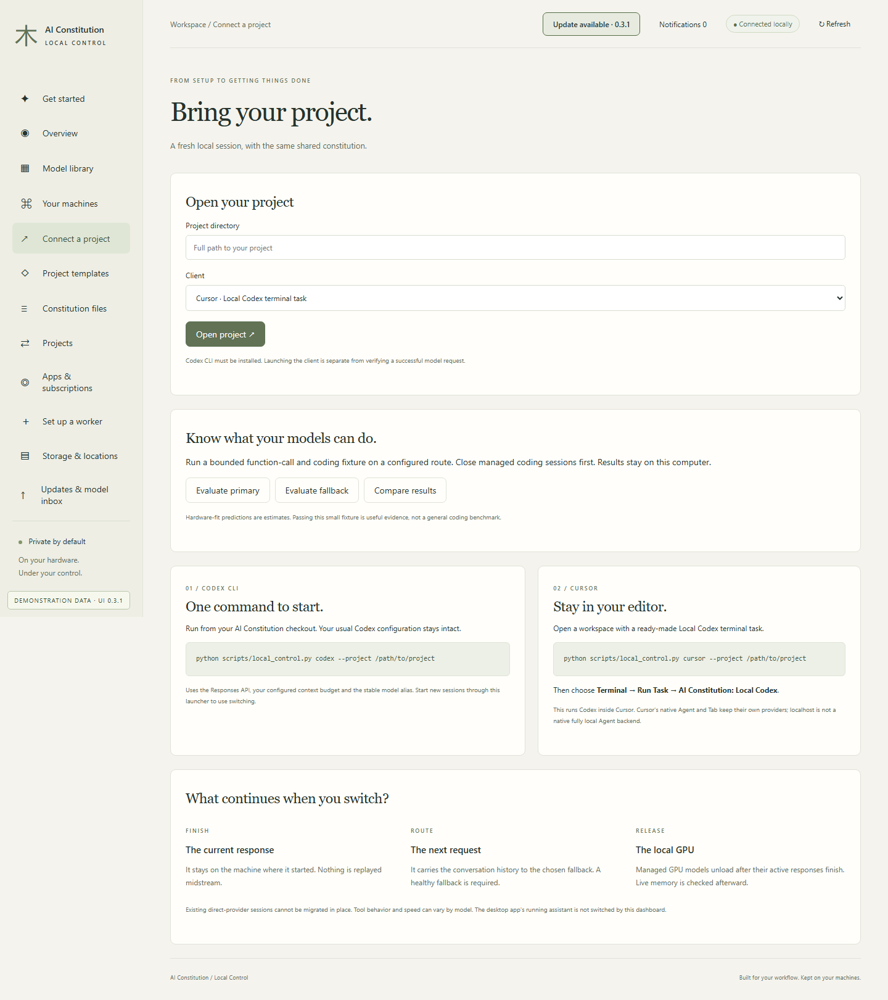
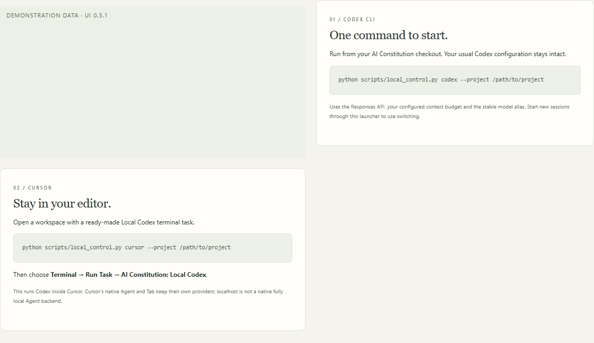
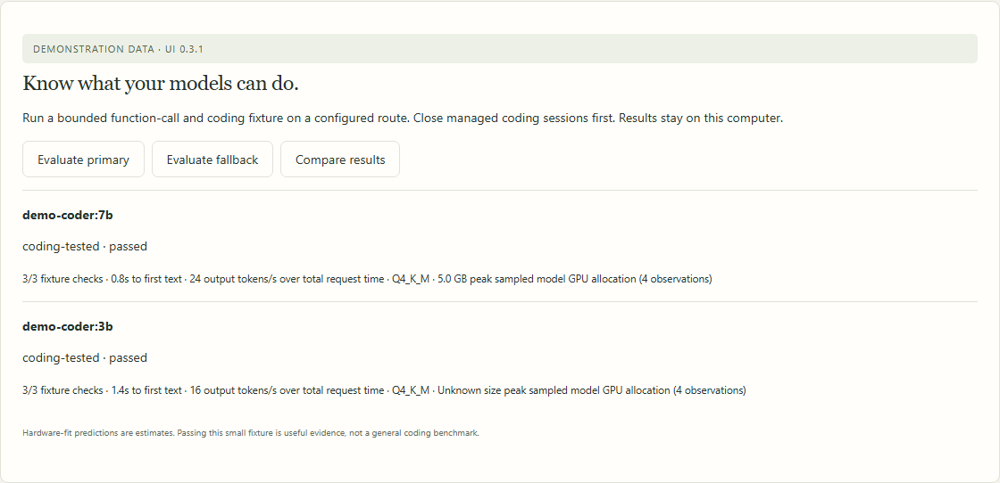

# Connect Codex and Cursor projects

[All workflows](README.md) · [Detailed instructions](../local-control.md)

Actual Local Control UI **0.3.1**, captured with fictional accounts, paths, models and usage. Performance numbers and update versions are examples, not benchmarks or release announcements. CLI images are rendered transcripts from real isolated commands. [How these images are made](../screenshot-maintenance.md).

## Connect a project

Open Connect a project from the sidebar. The page below uses fictional documentation data.

## Open a local Codex session

Select the project directory and client. The launcher starts a new session; it does not migrate a running direct-provider session.

## Run Local Codex inside Cursor

The supported Cursor workflow is a generated workspace with Terminal → Run Task → AI Constitution: Local Codex.

## Compare bounded coding checks

Choose Compare results after evaluating configured routes. Values in this example are simulated fixture results.

---

[Back to all workflows](README.md)
