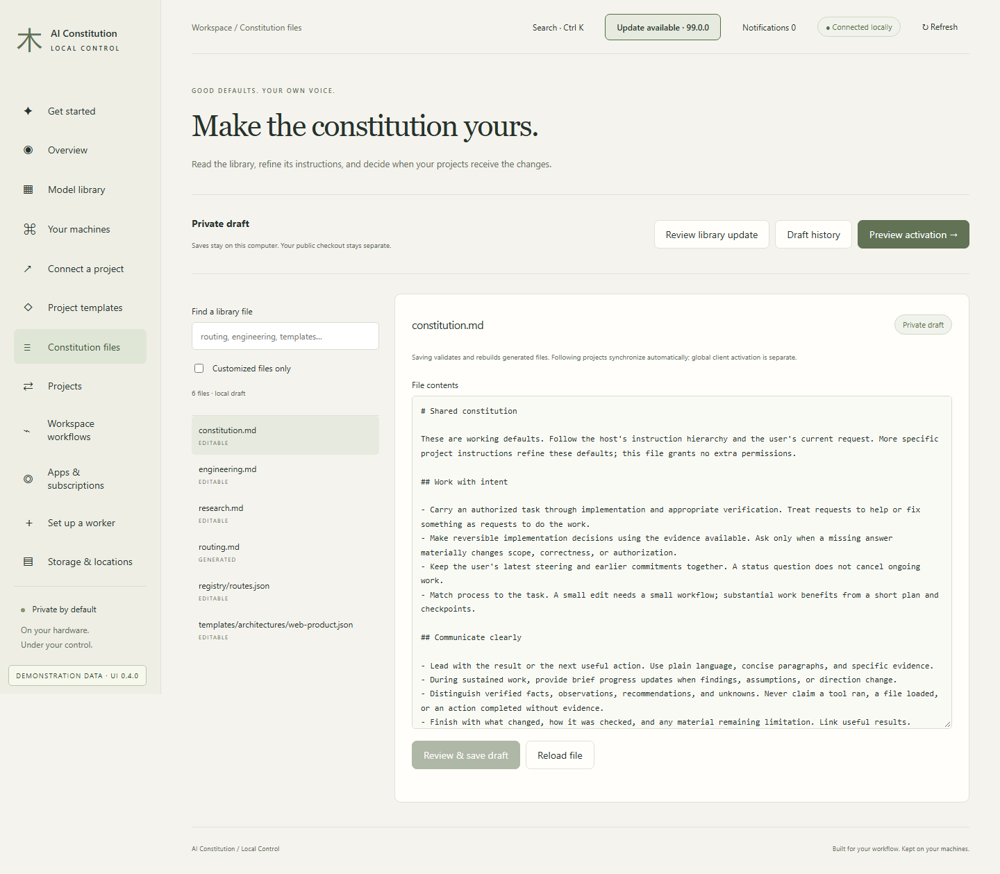
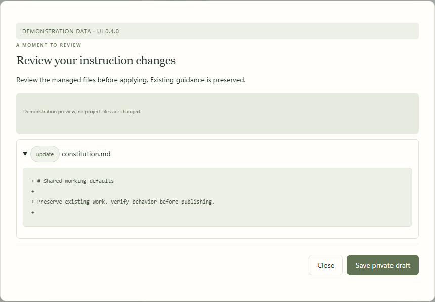
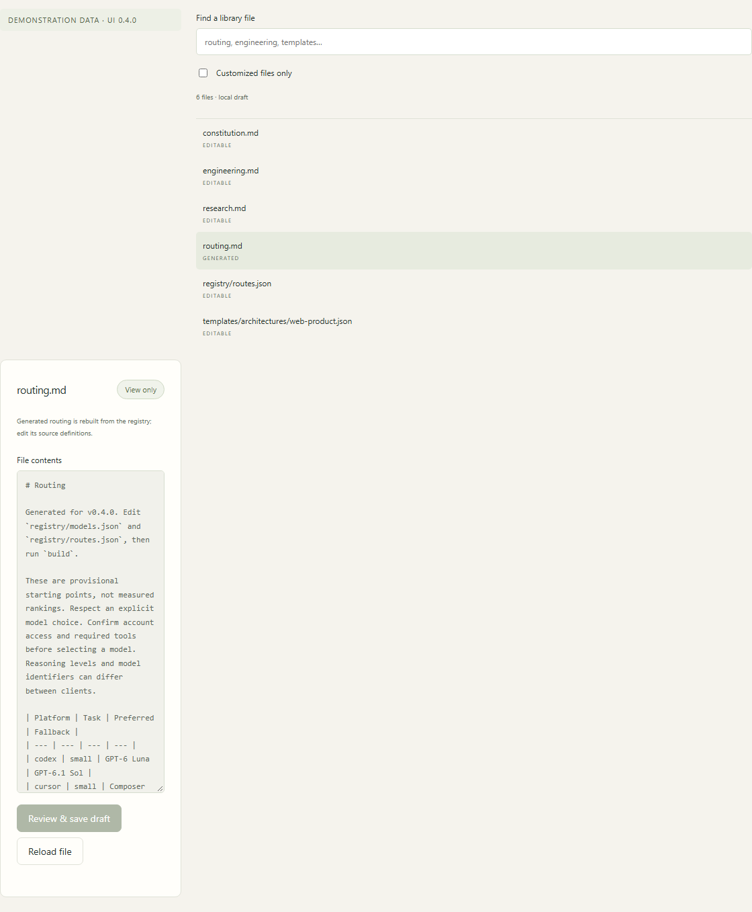
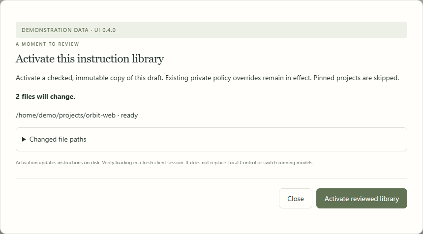
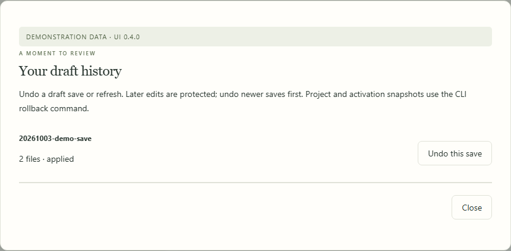
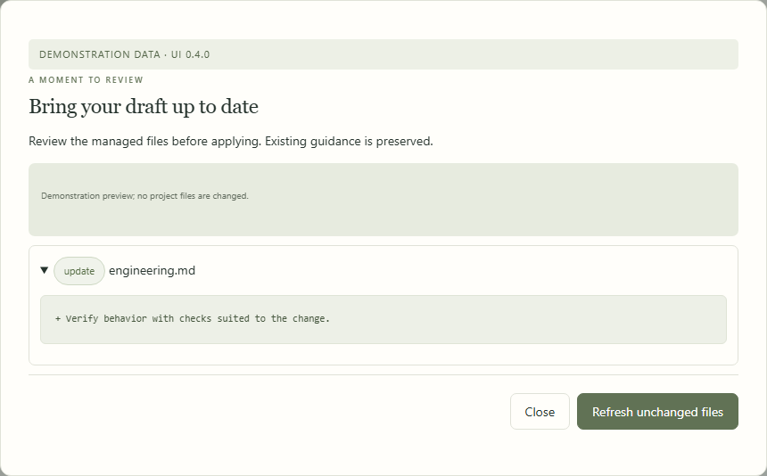

# Constitution files

[All workflows](README.md) · [Detailed instructions](../constitution-studio.md)

Actual Local Control UI **0.4.0**, captured with fictional accounts, paths, models and usage. Performance numbers and update versions are examples, not benchmarks or release announcements. CLI images are rendered transcripts from real isolated commands. [How these images are made](../screenshot-maintenance.md).

## Constitution files

Open Constitution files from the sidebar. The page below uses fictional documentation data.

## Review instruction edits

Edit your private draft and choose Review & save draft. Validation and generated-file rebuilding happen before saving.

## Inspect generated routing

Generated routing is view-only. Change source definitions and route choices, then rebuild.

## Review activation

Activation lists affected installations and file paths. Confirm instruction loading in a fresh client session afterward.

## Recover a previous draft

Draft history retains reviewed saves. Later edits are protected when undoing a save.

## Review a library refresh

Bring unchanged draft files up to date while preserving customizations. Activation remains a separate reviewed step.

---

[Back to all workflows](README.md)
