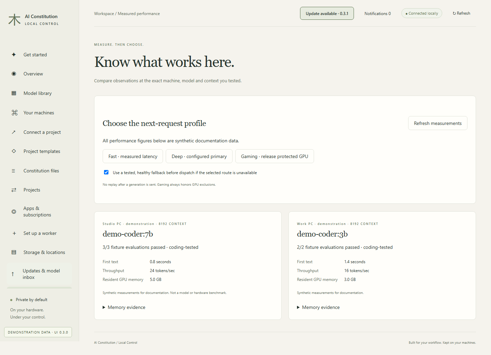
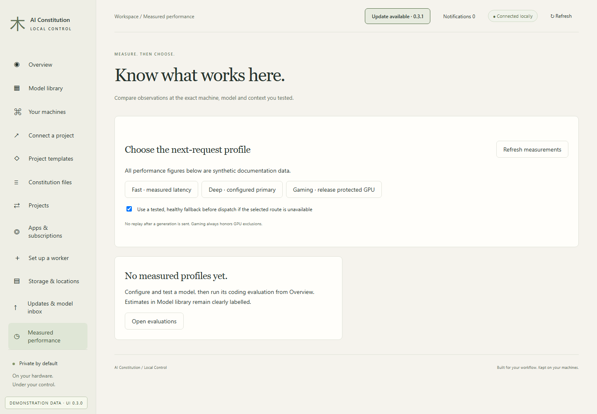

# Measured performance

[All workflows](README.md) · [Detailed instructions](../workspace-upgrades.md)

Actual Local Control UI **0.3.0**, captured with fictional accounts, paths, models and usage. Performance numbers and update versions are examples, not benchmarks or release announcements. CLI images are rendered transcripts from real isolated commands. [How these images are made](../screenshot-maintenance.md).

## Measured performance

Open Measured performance from the sidebar. The page below uses fictional documentation data.

## No measured profiles yet

Configure and evaluate a model before using measured profiles. Estimates and observations remain separate.

---

[Back to all workflows](README.md)
