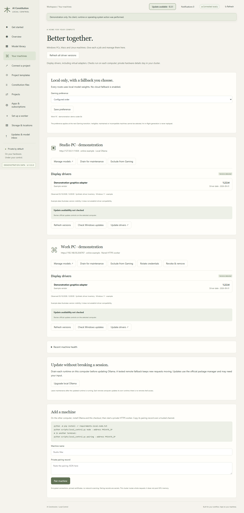
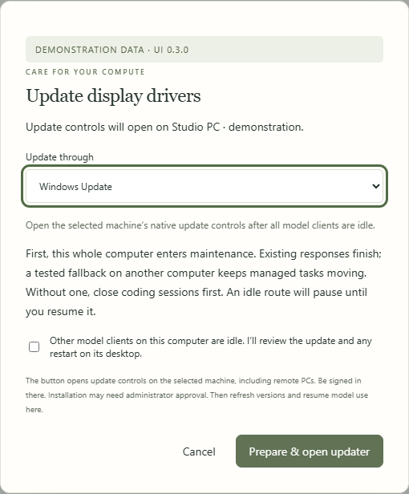
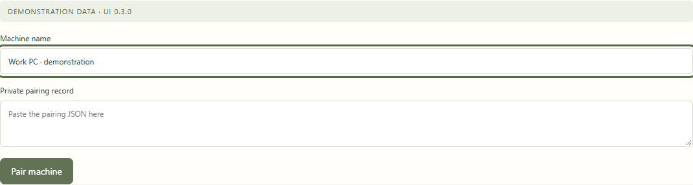

# Machines and drivers

[All workflows](README.md) · [Detailed instructions](../driver-maintenance.md)

Actual Local Control UI **0.3.0**, captured with fictional accounts, paths, models and usage. Performance numbers and update versions are examples, not benchmarks or release announcements. CLI images are rendered transcripts from real isolated commands. [How these images are made](../screenshot-maintenance.md).

## Your machines

Open Your machines from the sidebar. The page below uses fictional documentation data.

## Prepare driver maintenance

Review the target computer and update method. Confirm other clients are idle before opening that machine’s native updater.

## Pair a worker

Give the worker a recognizable name and paste its short-lived pairing record. The documentation leaves the credential field empty.

---

[Back to all workflows](README.md)
