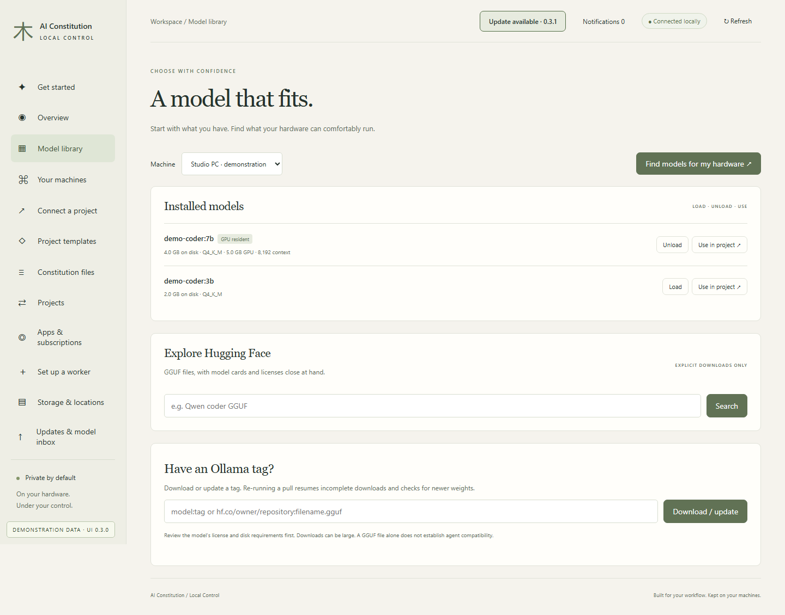
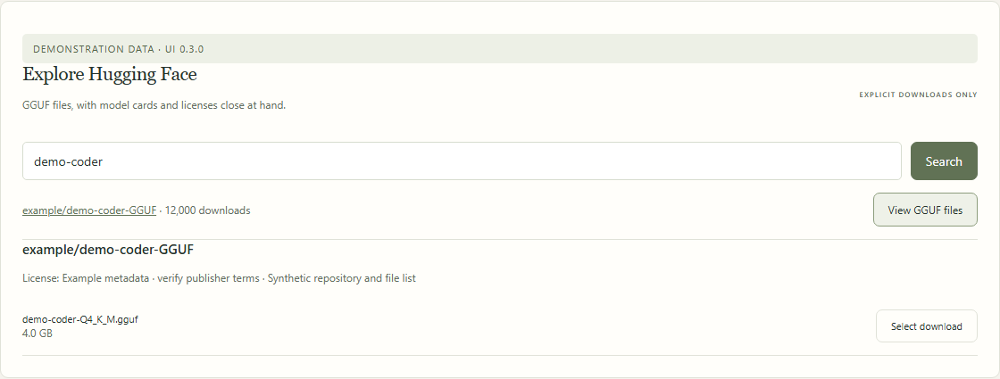
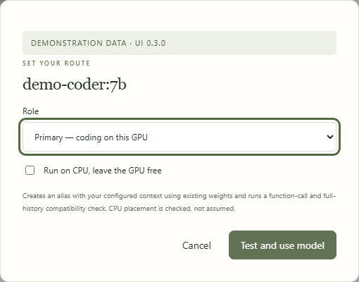
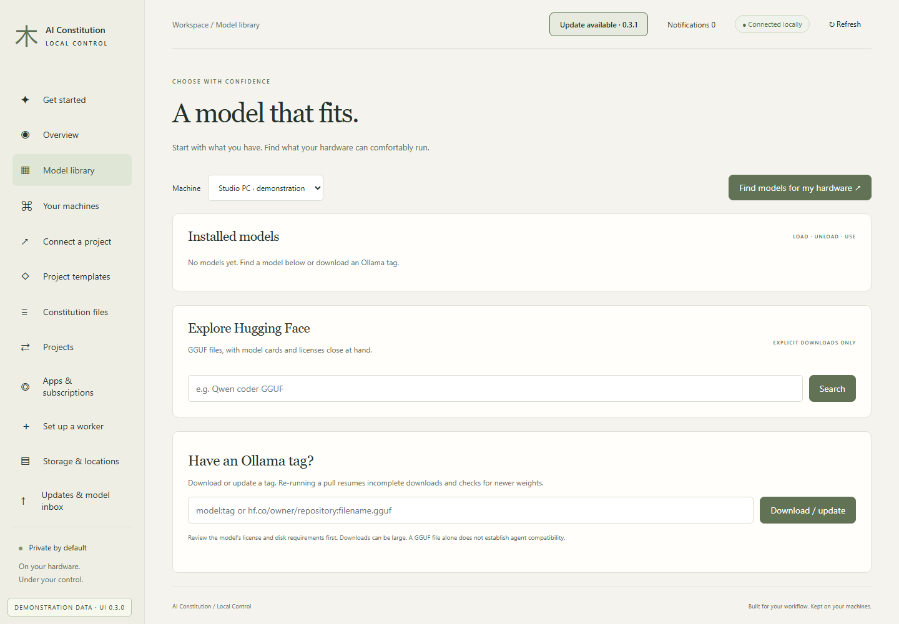

# Choose and manage models

[All workflows](README.md) · [Detailed instructions](../local-control.md)

Actual Local Control UI **0.3.0**, captured with fictional accounts, paths, models and usage. Performance numbers and update versions are examples, not benchmarks or release announcements. CLI images are rendered transcripts from real isolated commands. [How these images are made](../screenshot-maintenance.md).

## Model library

Open Model library from the sidebar. The page below uses fictional documentation data.

## Find models for your hardware

Choose Find models for my hardware. Estimated fit is shown separately from measured results.

## Review GGUF files

Search Hugging Face, open the file list, then review the model card, license and download size. This repository and model are fictional.

## Test a route

Use in project opens the route configuration. Choose primary or fallback and request CPU placement when appropriate.

## No models installed

An empty inventory is a starting point, not an error. Install a runtime and choose a model before configuring routes.

---

[Back to all workflows](README.md)
