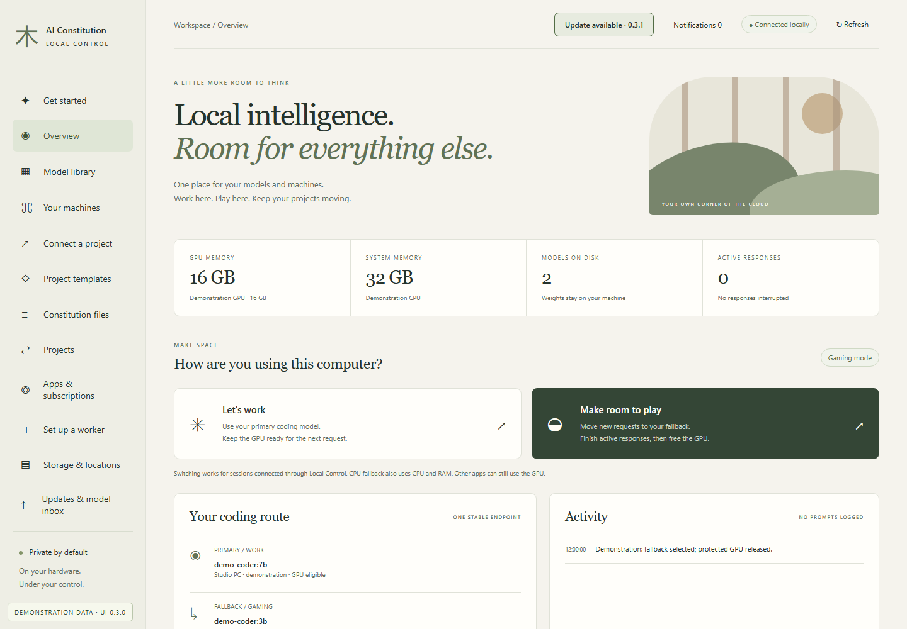

# Overview and GPU release

[All workflows](README.md) · [Detailed instructions](../local-control.md)

Actual Local Control UI **0.3.0**, captured with fictional accounts, paths, models and usage. Performance numbers and update versions are examples, not benchmarks or release announcements. CLI images are rendered transcripts from real isolated commands. [How these images are made](../screenshot-maintenance.md).

## Overview

Open Overview from the sidebar. The page below uses fictional documentation data.

## Gaming mode

After draining active responses, subsequent requests use the tested fallback and managed GPU residency is checked. This state is simulated; no GPU benchmark is claimed.

## Wait for the current response

A transition waits for the response already using the GPU. The next request can then use the fallback.

---

[Back to all workflows](README.md)
