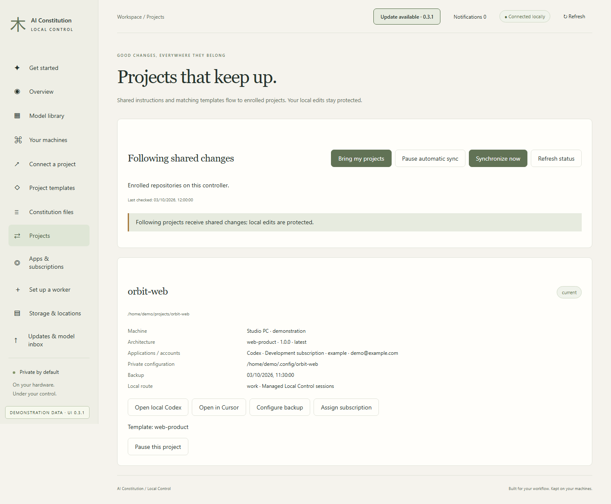
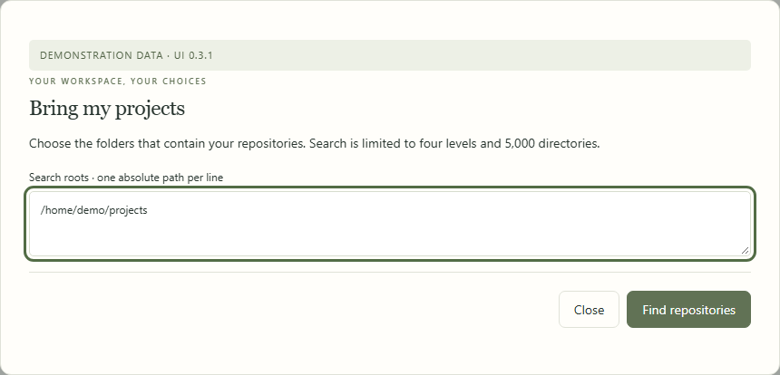
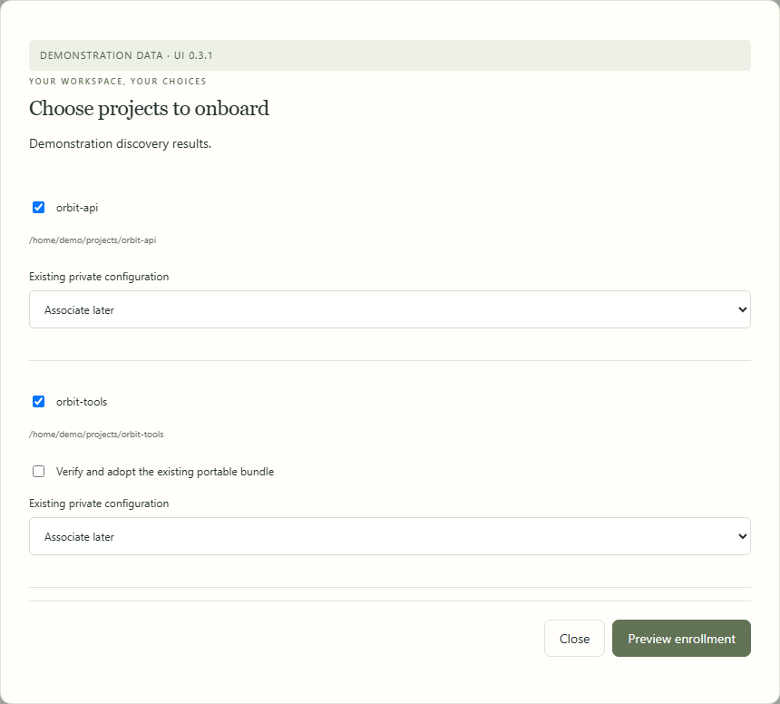
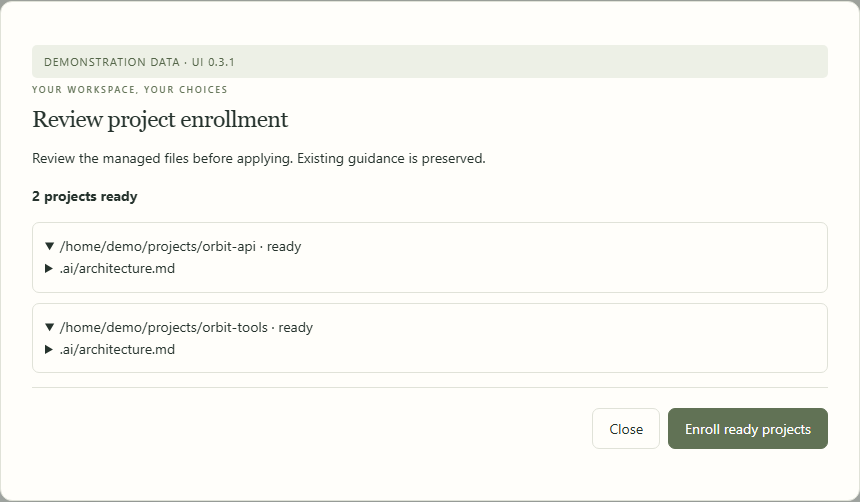
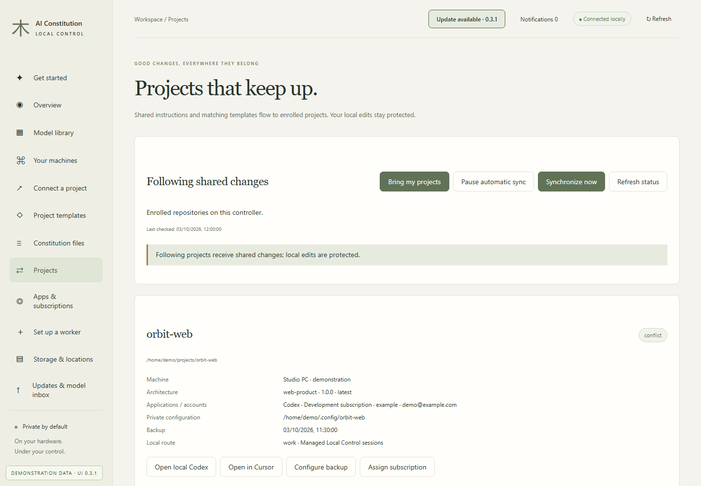
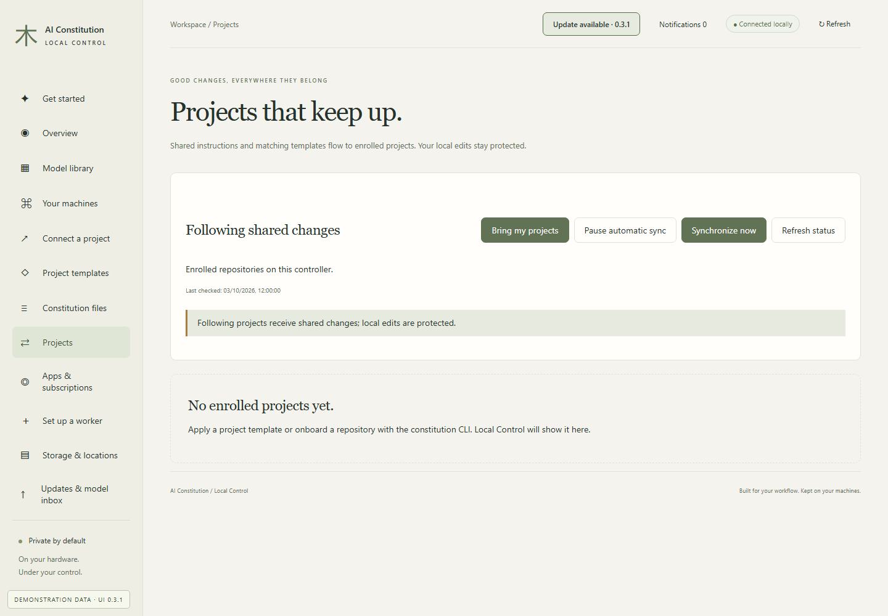

# Project onboarding and synchronization

[All workflows](README.md) · [Detailed instructions](../control-center.md)

Actual Local Control UI **0.3.1**, captured with fictional accounts, paths, models and usage. Performance numbers and update versions are examples, not benchmarks or release announcements. CLI images are rendered transcripts from real isolated commands. [How these images are made](../screenshot-maintenance.md).

## Projects

Open Projects from the sidebar. The page below uses fictional documentation data.

## Choose repository roots

Bring my projects searches the roots you specify. It skips dependencies, build folders and filesystem links.

## Select repositories and mappings

Choose repositories to enroll, associate existing private configuration, and explicitly adopt portable bundles when applicable.

## Review enrollment

The enrollment preview lists proposed managed-file changes. Only ready repositories are enrolled when you apply.

## Resolve a synchronization conflict

Local managed-file edits stop synchronization for the affected project. Review the change before retrying.

## Start with no enrolled projects

Use Bring my projects or apply a baseline to create your first enrollment.

---

[Back to all workflows](README.md)
