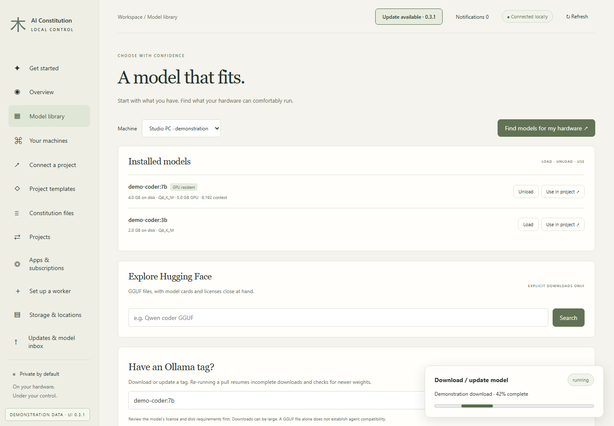
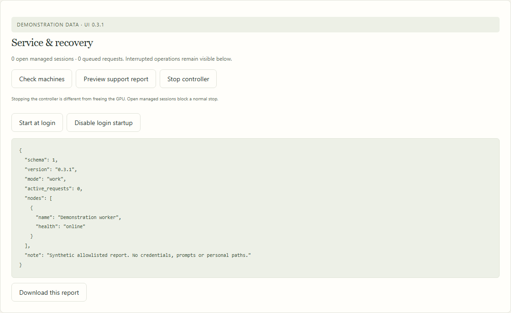
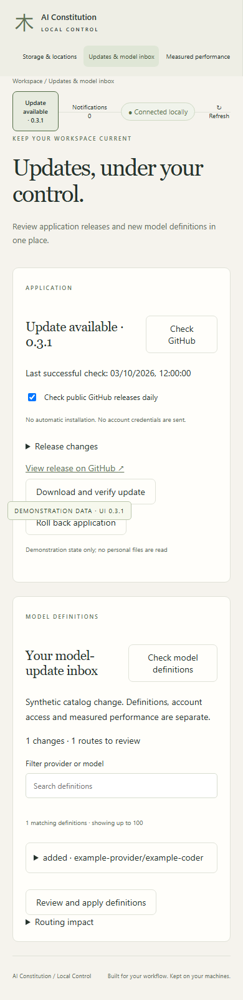
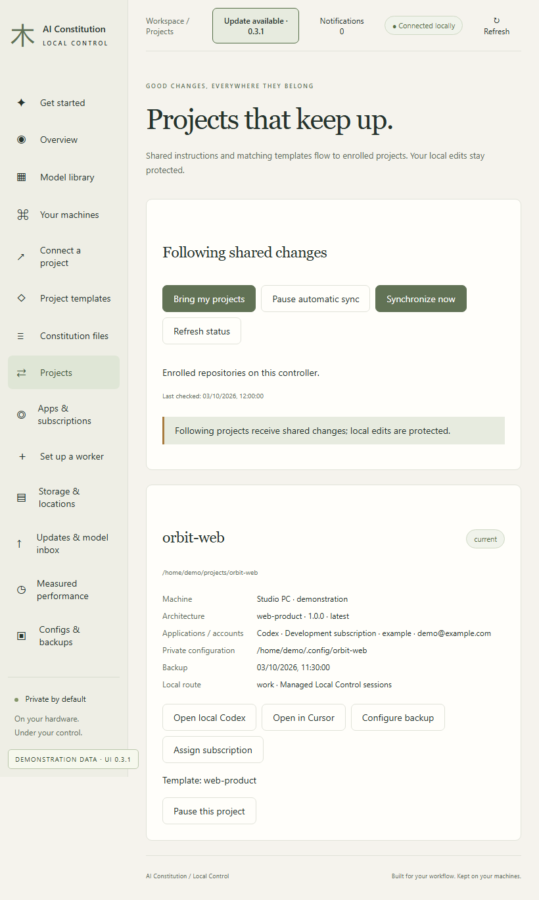

# Progress and recovery

[All workflows](README.md) · [Detailed instructions](../workspace-upgrades.md)

Actual Local Control UI **0.3.1**, captured with fictional accounts, paths, models and usage. Performance numbers and update versions are examples, not benchmarks or release announcements. CLI images are rendered transcripts from real isolated commands. [How these images are made](../screenshot-maintenance.md).

## Review actionable failures

Unacknowledged failures remain visible. Open the recovery page for a fresh preview and retry.

## Keep using the dashboard during a job

A model download shows durable operation progress. This demonstration simulates progress without downloading weights.

## Preview support information

Review the allowlisted diagnostic report before downloading it. Prompts, credentials and private raw provider errors are excluded.

## Use a smaller screen

The same update controls remain available on a smaller viewport. This is responsive-browser coverage, not a native mobile app.

## Project cards on a tablet-sized viewport

Project information and actions adapt to the available width.

---

[Back to all workflows](README.md)
