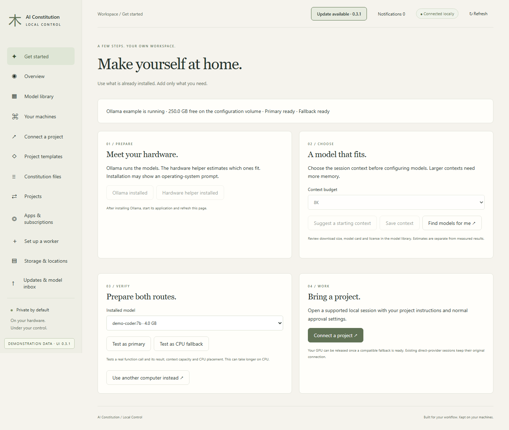
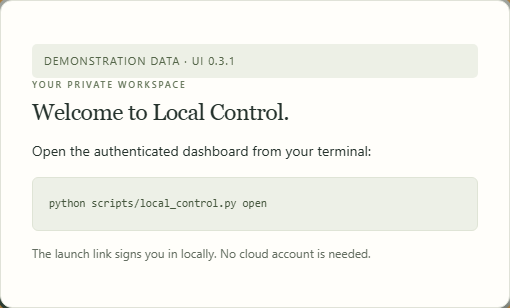

# Get started

[All workflows](README.md) · [Detailed instructions](../getting-started.md)

Actual Local Control UI **0.3.1**, captured with fictional accounts, paths, models and usage. Performance numbers and update versions are examples, not benchmarks or release announcements. CLI images are rendered transcripts from real isolated commands. [How these images are made](../screenshot-maintenance.md).

## Get started

Open Get started from the sidebar. The page below uses fictional documentation data.

## Open the authenticated dashboard

Opening the bare address shows this welcome dialog. Run the displayed open command to sign in locally.

---

[Back to all workflows](README.md)
