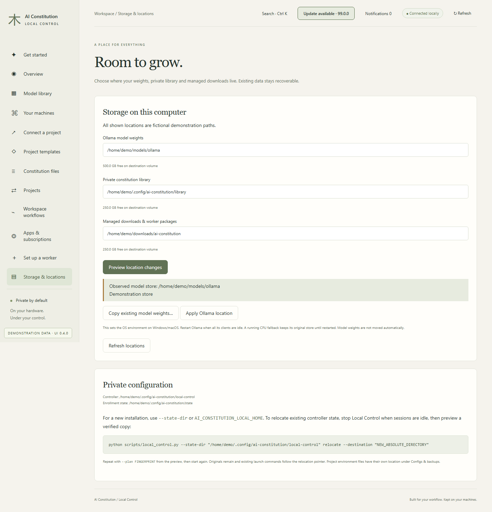
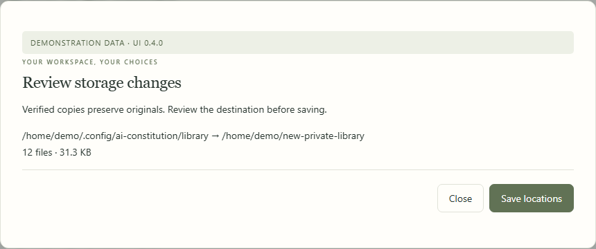
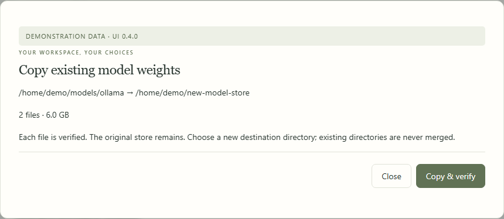

# Storage locations

[All workflows](README.md) · [Detailed instructions](../control-center.md)

Actual Local Control UI **0.4.0**, captured with fictional accounts, paths, models and usage. Performance numbers and update versions are examples, not benchmarks or release announcements. CLI images are rendered transcripts from real isolated commands. [How these images are made](../screenshot-maintenance.md).

## Storage & locations

Open Storage & locations from the sidebar. The page below uses fictional documentation data.

## Review location changes

Choose new locations and review verified copies before saving. Existing storage is preserved.

## Copy and verify weights

Copy existing weights into a new destination. Review the file count and size before starting.

---

[Back to all workflows](README.md)
