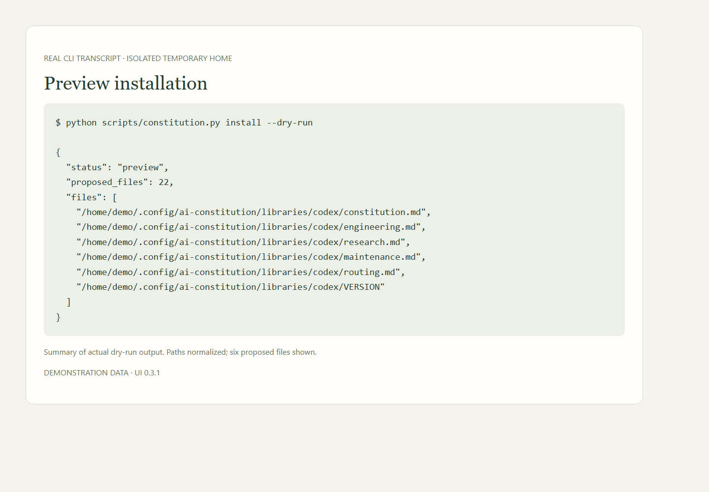

# Instruction toolkit and external setup

[All workflows](README.md) · [Detailed instructions](../getting-started.md)

Actual Local Control UI **0.3.1**, captured with fictional accounts, paths, models and usage. Performance numbers and update versions are examples, not benchmarks or release announcements. CLI images are rendered transcripts from real isolated commands. [How these images are made](../screenshot-maintenance.md).

## Verify the instruction toolkit

A rendered transcript of a real isolated CLI check. This image is not a screenshot of a terminal application.

## Preview installation

A rendered summary from a real dry-run against a temporary home. No live Codex or Cursor files are written.

## External application captures

The dashboard shows connection instructions; these external interfaces still need actual application or OS screenshots. They are **pending**, not represented by mockups.

| Interface | Status | Instructions |
| --- | --- | --- |
| Cursor task picker and local terminal session | pending | [Guide](../../docs/local-control.md) |
| Codex instruction-loading verification | pending | [Guide](../../onboarding/project.md) |
| xAI Grok Bot instruction setup | pending | [Guide](../../onboarding/bot.md) |
| Windows native driver update controls | pending | [Guide](../../docs/driver-maintenance.md) |
| macOS native Software Update | pending | [Guide](../../docs/driver-maintenance.md) |
| Ollama native installation | pending | [Guide](../../docs/local-models.md) |

Use the linked guides now. See the [capture checklist](../screenshot-maintenance.md#external-applications) to contribute a reviewed screenshot.

---

[Back to all workflows](README.md)
