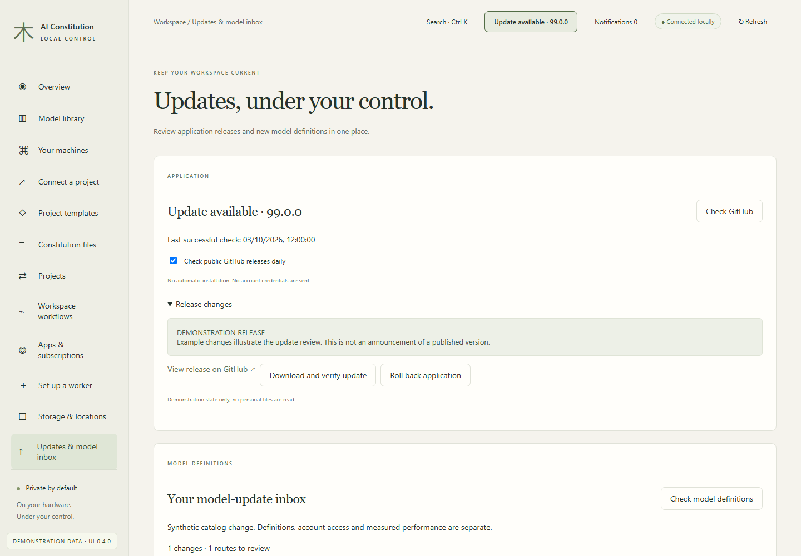
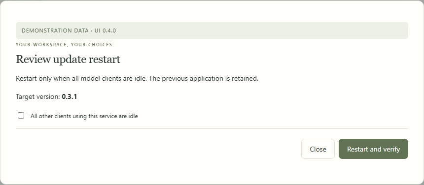
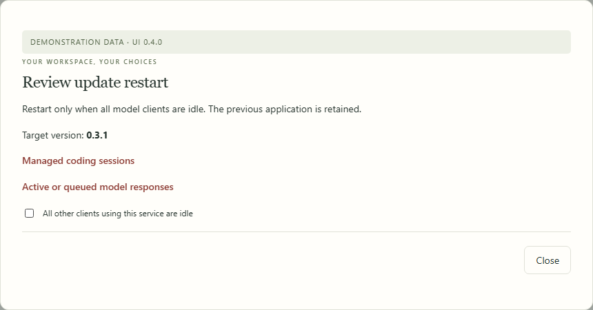
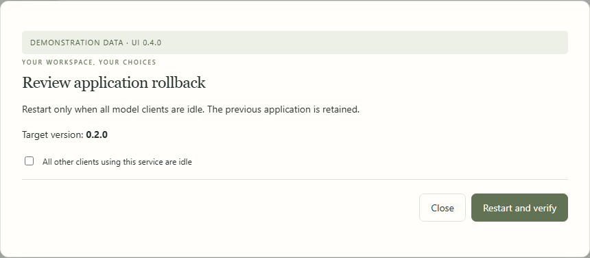
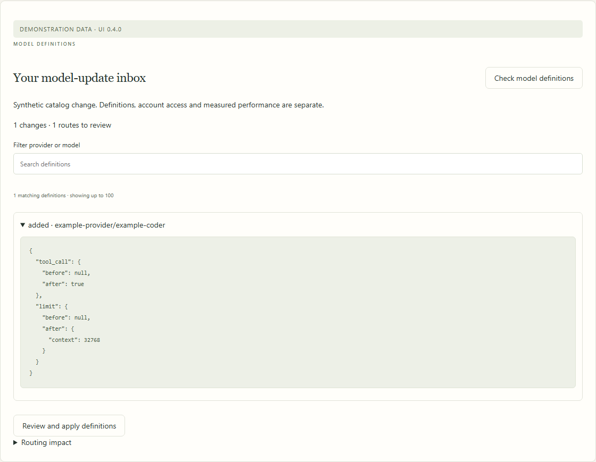
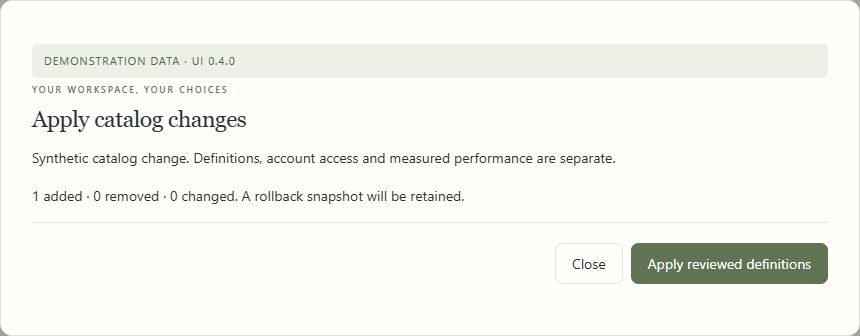

# Application and model updates

[All workflows](README.md) · [Detailed instructions](../workspace-upgrades.md)

Actual Local Control UI **0.4.0**, captured with fictional accounts, paths, models and usage. Performance numbers and update versions are examples, not benchmarks or release announcements. CLI images are rendered transcripts from real isolated commands. [How these images are made](../screenshot-maintenance.md).

## Updates & model inbox

Open Updates & model inbox from the sidebar. The page below uses fictional documentation data.

## Read release changes

The header notification opens Updates. Expand Release changes before choosing a verified download. The displayed release is fictional.

## Review an update restart

After verification, restart only when tracked and external clients are idle. Private settings and model storage are retained.

## Active work blocks restart

Active responses and managed sessions block restart. Finish the work and request a fresh preview.

## Review application rollback

Rollback uses the retained application and the same idle-service safeguards.

## Inspect changed model fields

Review catalog differences and routing impact. Importing definitions does not establish account access or change a running model.

## Review catalog application

Apply only the reviewed definitions. A transaction snapshot is retained and stale previews are refused.

---

[Back to all workflows](README.md)
