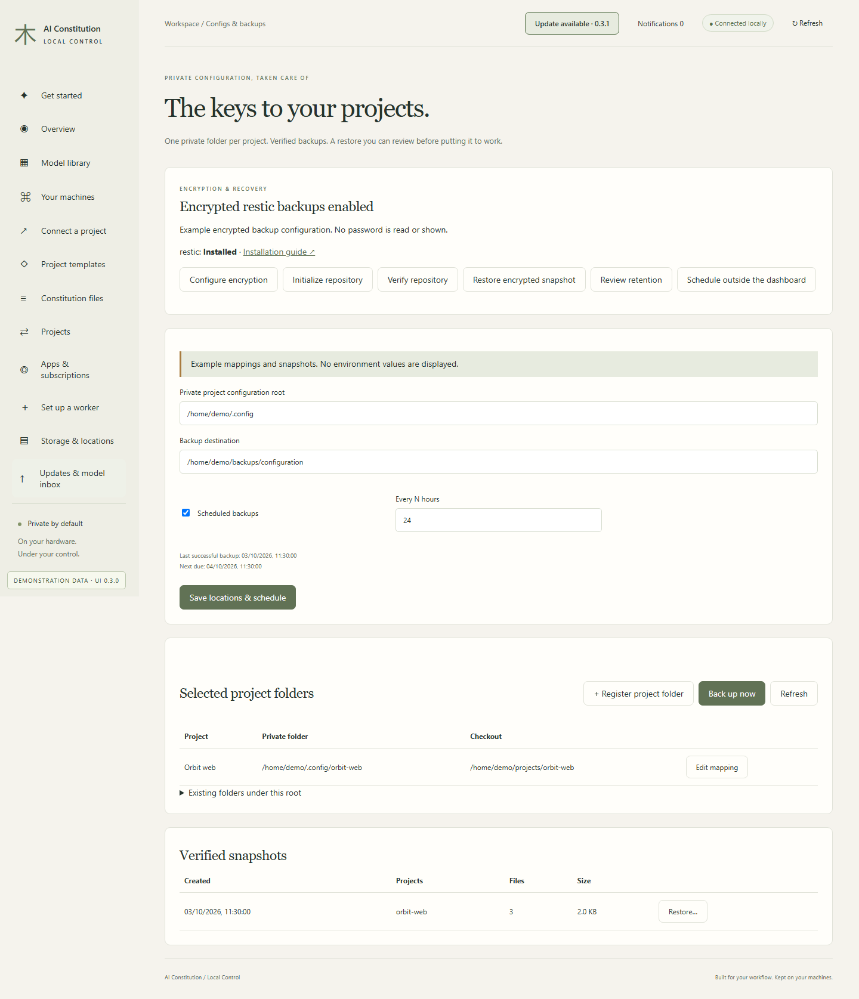
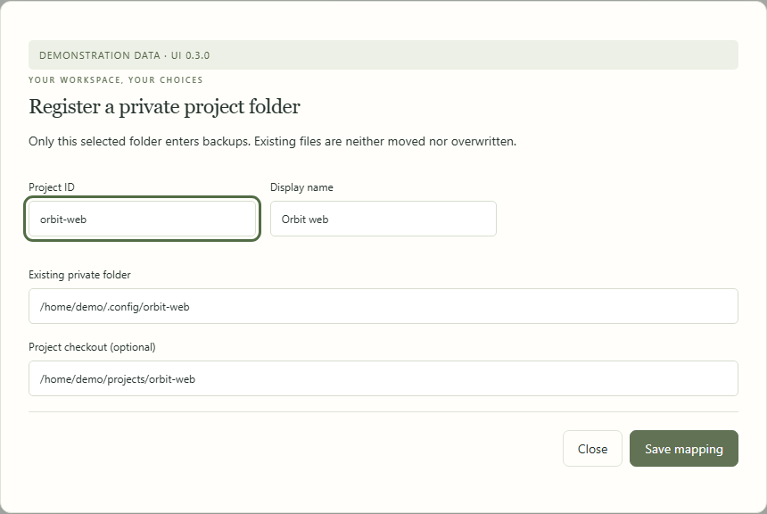
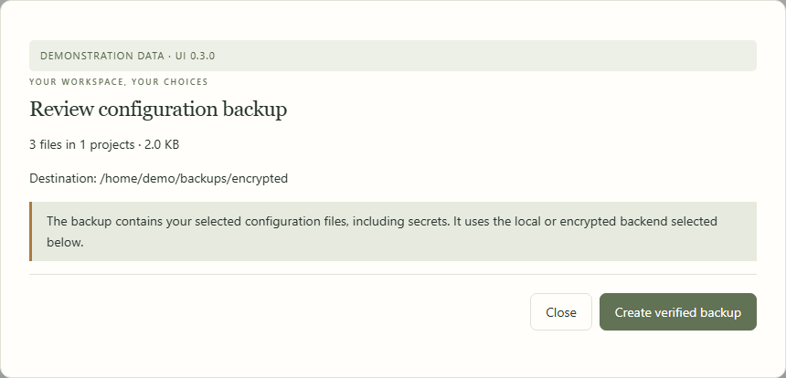
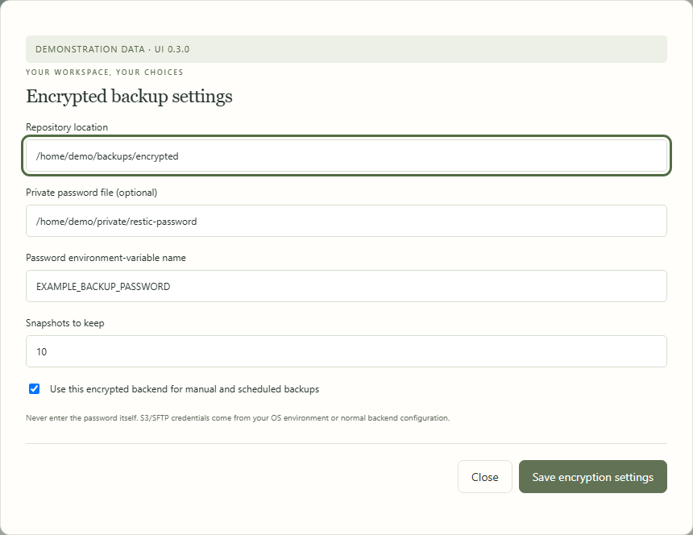
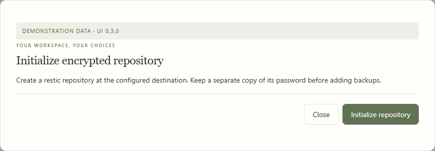
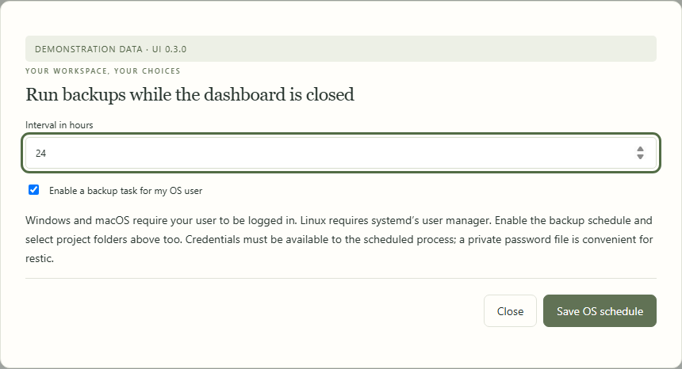
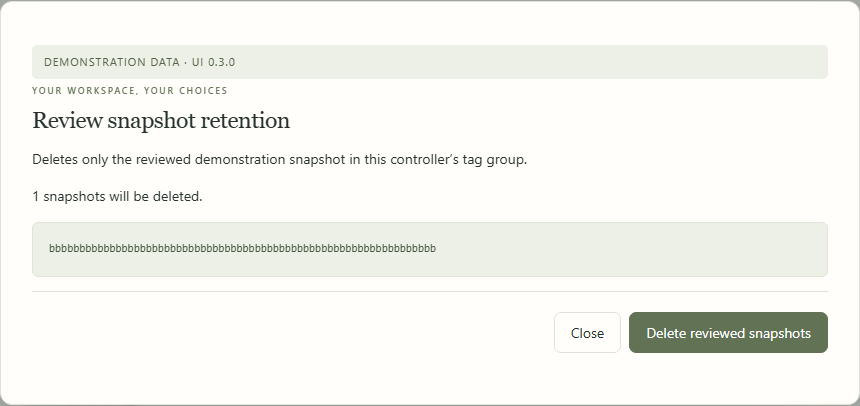
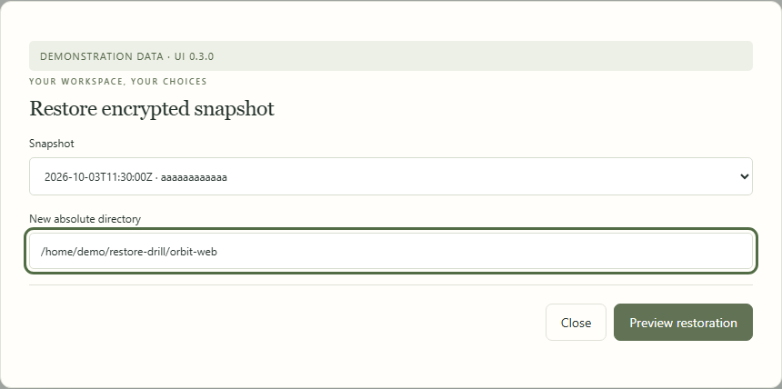
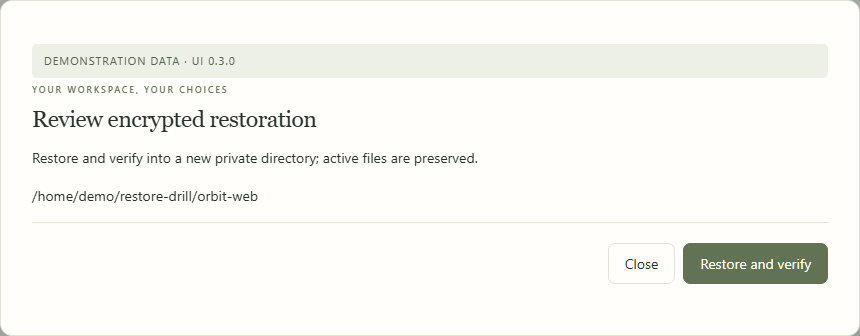
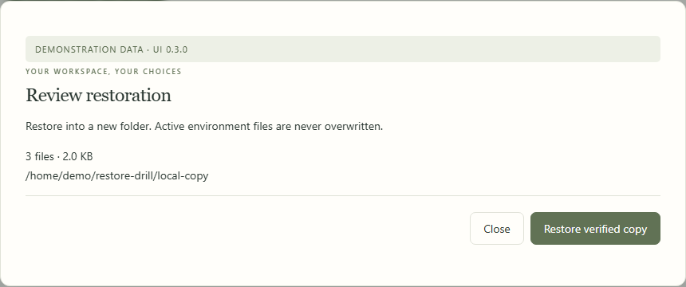

# Private configuration and backups

[All workflows](README.md) · [Detailed instructions](../encrypted-backups.md)

Actual Local Control UI **0.3.0**, captured with fictional accounts, paths, models and usage. Performance numbers and update versions are examples, not benchmarks or release announcements. CLI images are rendered transcripts from real isolated commands. [How these images are made](../screenshot-maintenance.md).

## Configs & backups

Open Configs & backups from the sidebar. The page below uses fictional documentation data.

## Register a project configuration folder

Map an existing private configuration folder to its project. Only selected folders enter backups.

## Review a configuration backup

Check selected projects, file count, size and the actual backend destination before creating a verified backup.

## Configure encrypted backups

Configure the restic repository, password-file location or environment-variable name, and retention count. The password itself is never entered here.

## Initialize the repository

Initialize the configured encrypted repository and retain its password separately before backing up.

## Schedule backups outside the dashboard

Create a task for the current OS user. Its credential source must be available to the scheduled process.

## Review retention deletion

Deletion is limited to the reviewed snapshot IDs in this controller’s tag group.

## Select an encrypted snapshot

Choose a snapshot and a new directory before requesting the restoration preview.

## Review an encrypted restore

Restore and verify into the new private destination. Active configuration is preserved.

## Restore a local snapshot

Local snapshots also restore into a new directory. Review restored files before changing the project mapping.

---

[Back to all workflows](README.md)
