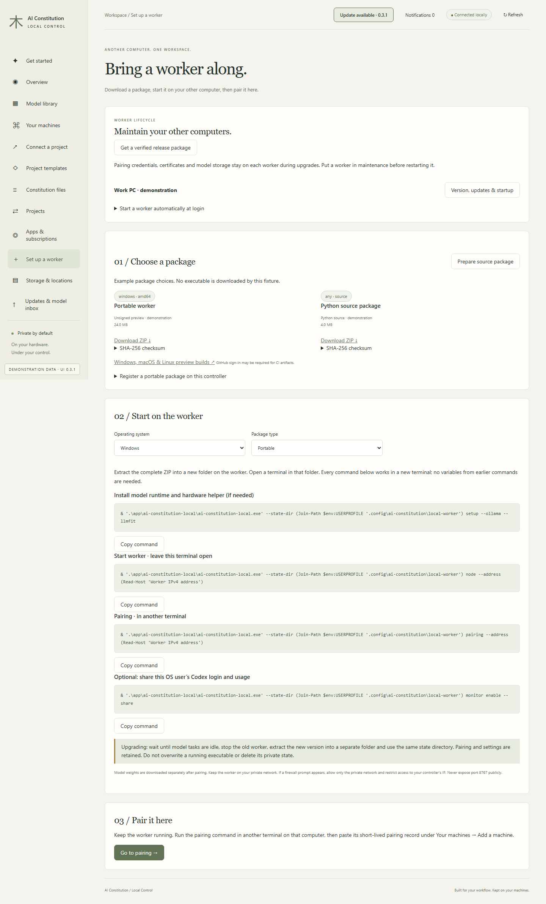
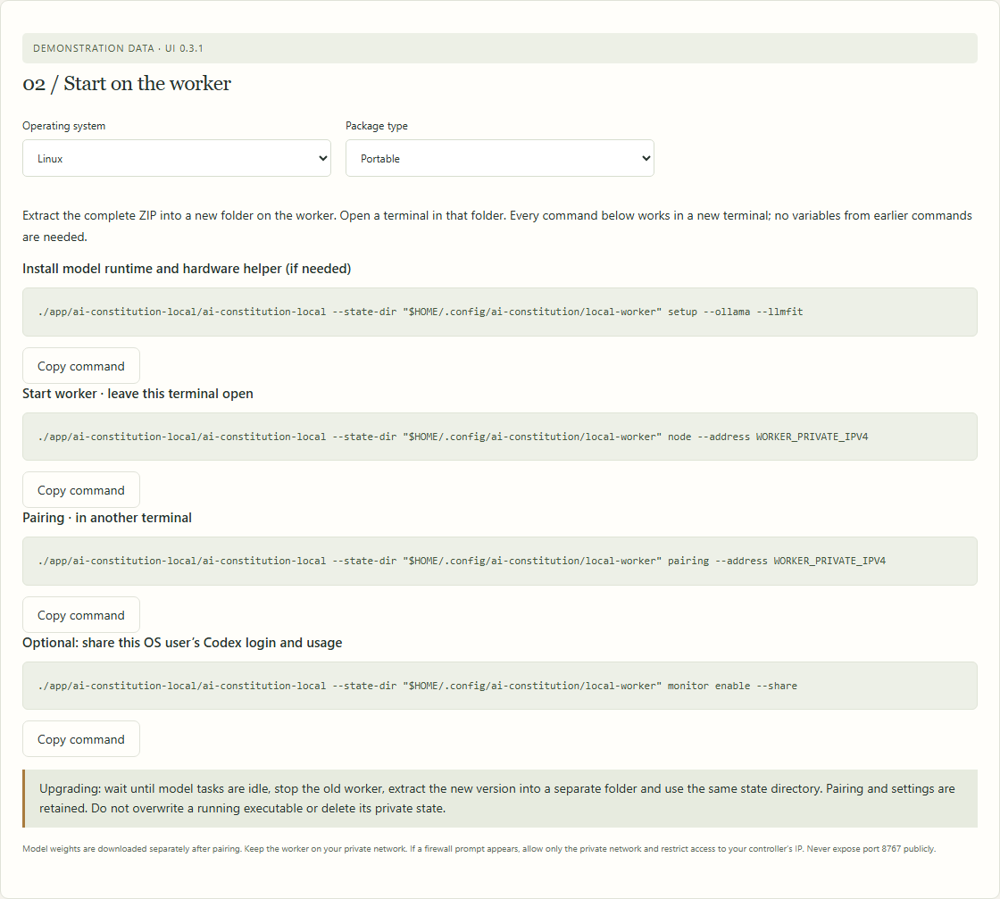
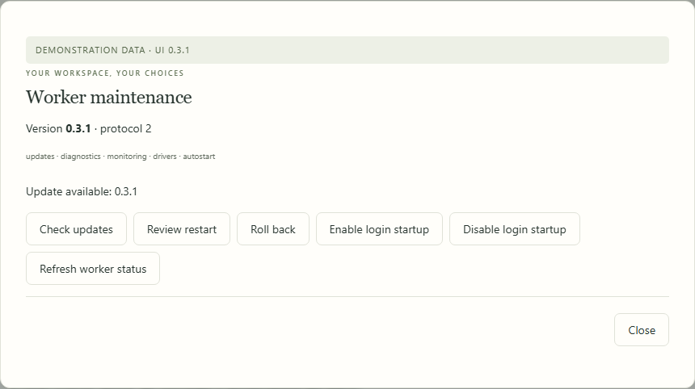

# Worker installation and upgrades

[All workflows](README.md) · [Detailed instructions](../windows-worker.md)

Actual Local Control UI **0.3.1**, captured with fictional accounts, paths, models and usage. Performance numbers and update versions are examples, not benchmarks or release announcements. CLI images are rendered transcripts from real isolated commands. [How these images are made](../screenshot-maintenance.md).

## Set up a worker

Open Set up a worker from the sidebar. The page below uses fictional documentation data.

## Get a verified worker package

Choose Windows x64, Apple Silicon or Linux x64. Source packages support other compatible environments.

## Worker commands · windows

Choose the OS and package type, then copy each command into a fresh terminal. These are screenshots of the dashboard’s instructions, not the operating-system terminal.

## Worker commands · macos

Choose the OS and package type, then copy each command into a fresh terminal. These are screenshots of the dashboard’s instructions, not the operating-system terminal.

## Worker commands · linux

Choose the OS and package type, then copy each command into a fresh terminal. These are screenshots of the dashboard’s instructions, not the operating-system terminal.

## Worker version and updates

Review version and capabilities, check updates, manage login startup and prepare a guarded restart. Other controllers using the worker must also be idle.

---

[Back to all workflows](README.md)
