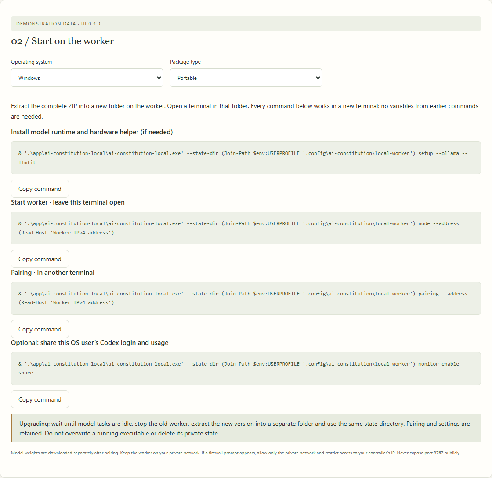

# Set up a second Windows computer

Use this on a trusted home LAN. RustDesk can transfer the portable package and let you run the commands on the second computer; it is not the model transport. Keep Ollama bound to loopback. Do not forward router ports or expose the worker to the internet.

1. Download a reviewed [Windows portable preview](desktop-preview.md) and extract the **whole archive** to a permanent folder on the second computer. Keep `app`, license notices and the manifest together. The app is unsigned; if operating-system policy blocks it, use the documented source/Python path rather than disabling security protections.
2. Open PowerShell in that extracted folder. Set up the executable and a separate worker profile:

   ```powershell
   $workerExe = (Resolve-Path '.\app\ai-constitution-local\ai-constitution-local.exe').Path
   $workerState = Join-Path $env:USERPROFILE '.config\ai-constitution\local-worker'
   & $workerExe --state-dir $workerState setup --ollama --llmfit
   ```

   Start the Ollama app from the Start menu after installation. Reopen PowerShell if its installer changed PATH, then repeat the two variable assignments. Existing model weights are reused; no weights are downloaded in this step.

3. Find the **second computer's private IPv4 address** in Windows network settings or `ipconfig`. Use the physical Ethernet/Wi-Fi interface on the same home LAN as the controller. Start the worker in this PowerShell window:

   ```powershell
   & $workerExe --state-dir $workerState node --address SECOND_PC_IP
   ```

   Replace `SECOND_PC_IP`, for example with `192.168.1.50`. Leave this window running. The worker listens on HTTPS port 8767, creates a private certificate and keeps its secrets in the worker profile.

4. If Windows Firewall blocks the connection, add a narrowly scoped rule from **administrator PowerShell on the second computer**. Substitute the actual executable path and the main computer's private IP:

   ```powershell
   New-NetFirewallRule -DisplayName 'AI Constitution worker - home controller' -Direction Inbound -Action Allow -Protocol TCP -LocalPort 8767 -RemoteAddress MAIN_PC_IP -Profile Private -Program 'FULL_PATH_TO_WORKER_EXE'
   ```

   Use a trusted Private network profile. Do not enable Public access or turn off the firewall. If the main computer's DHCP address changes, update this rule deliberately.

5. Open another normal PowerShell in the extracted folder, repeat the variable assignments from step 2, and generate a pairing record:

   ```powershell
   & $workerExe --state-dir $workerState pairing --address SECOND_PC_IP
   ```

   The record expires in five minutes and works once. Copy it directly into **Your machines → Add a machine** in the main computer's Local Control dashboard. Give the worker a recognizable name. Do not paste this record into a GitHub issue, repository, public screenshot or chat transcript.

6. On the main computer, select the new machine in **Model library**. Check its hardware suggestions and installed models. Choose a tool-capable model, download it explicitly, then test it as a fallback. Use **Remote computer first, then CPU** in Your machines if that is your preferred Gaming policy. Routes share the configured context budget; a smaller worker may require smaller compatible models or a fresh lower-context profile.

7. Verify one request with the new fallback, then switch to Gaming and confirm the main computer's managed GPU allocation is zero. Keep both computers awake during initial tests. An in-flight response cannot move between computers if a worker sleeps or loses its network connection.

<!-- screenshots:commands:begin -->

**In the dashboard · Worker commands · windows.** Choose the OS and package type, then copy each command into a fresh terminal. These are screenshots of the dashboard’s instructions, not the operating-system terminal.



[Illustrated walkthrough](manual/workers.md) · Fictional data; UI 0.3.0.

<!-- screenshots:commands:end -->

## Stop, update or remove

Drain the machine through the controller's **Your machines** page before stopping its worker window with Ctrl+C. Active response leases prevent normal shutdown; other directly connected clients cannot be tracked between requests. For runtime upgrades on a worker, drain it, finish or stop any other local sessions, and use the runtime's official updater on that computer. Restart the worker, check health and re-test its route before leaving maintenance.

The worker uses a separate state directory, so an existing controller on the second PC keeps its own configuration. Optional controller login startup does not start a worker automatically. Worker startup at login and a Windows service installer are not enabled by this guide.

If pairing fails, verify the address, Private firewall rule, port, worker window and code expiry. A changed certificate requires explicit re-pairing; it is never trusted silently. Use `controllers --address SECOND_PC_IP` on the worker with the same state directory to inspect and revoke old controller IDs. Revoke access before removing a trusted machine permanently. Preserve model weights and private state unless you explicitly intend to remove them.
