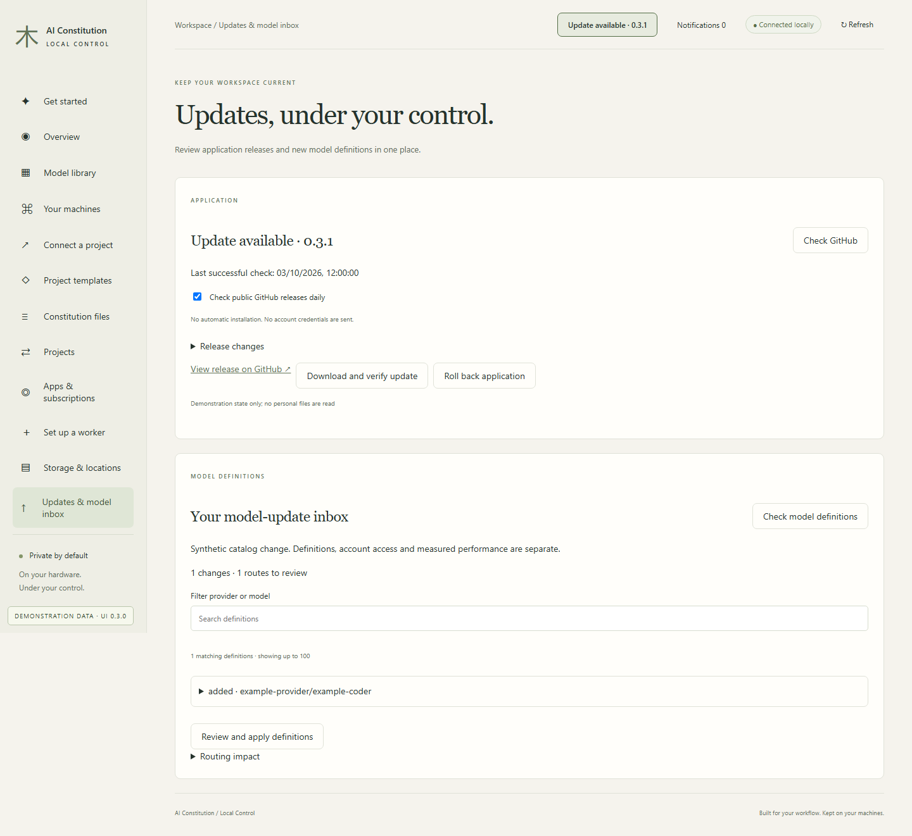
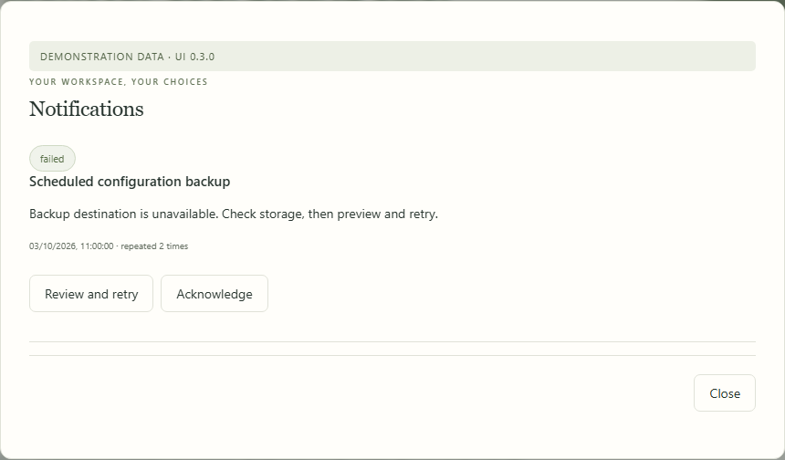

# A workspace you can maintain

Local Control 0.3 adds project onboarding, application updates, encrypted backup integration and recovery controls. The core instruction toolkit still needs only Python 3.11+; the dashboard remains a private, optional companion.

## Bring existing projects

Open **Projects → Bring my projects**, enter your repository roots, and select the repositories you want to enroll. Discovery examines names to a maximum depth of four, 5,000 directories and 200 repositories. It skips dependency/build folders and filesystem links. A preview shows every proposed managed-file change and any conflicts; only ready projects are enrolled when you apply it.

Existing portable bundles require explicit adoption and consistency verification. Existing project guidance is preserved. Associate a previously registered configuration folder during enrollment, or add it later in **Configs & backups**. No environment values are copied into project instructions.

Project cards show local enrollment, architecture revision and follow/pin policy, declared app/account assignments, private configuration mapping, backup status and the route used by Local Control sessions. Resolve configuration or account gaps from the card. The list covers repositories enrolled on the controller’s computer; it does not silently scan workers or imply that an agent has loaded installed instructions.

## Update available

**Updates & model inbox** checks the public GitHub release API daily while the controller runs. Disable automatic checks there if desired. A newer stable release displays an **Update available** button in the header; a failed check retains the last successful result with its timestamp.

1. Read the release notes and choose **Download and verify update**.
2. The matching source or native package is downloaded from this project’s GitHub releases. Its SHA-256 and complete file manifest are verified before staging it outside your checkout. The current application is also retained as a verified rollback copy.
3. Choose **Review restart**. Active responses, queued operations and managed sessions block a restart. Confirm that other clients are idle.
4. Local Control restarts from the staged application and checks its reported version. The page reconnects using the same private authentication state. If the new process exits during startup, the previous application is restarted. If startup is ambiguous, the process is preserved and a recovery error is shown; an unverified process is never killed blindly.

**Roll back application** uses the same idle-service safeguards. Rollback changes application code, not your model weights or selected storage locations. Existing launch commands for the previous checkout/package forward to the verified active application. Keep that original entry point available for shortcuts and OS startup registrations. Source installations retain their Python interpreter; new optional runtime dependencies may require a separate environment update.

This flow does not reset Git branches or discard local edits. Checksums detect corruption; GitHub build attestations provide workflow provenance. Neither substitutes for an OS publisher signature. Unsigned builds remain visibly labelled preview.

Workers supporting protocol 2 expose the same guarded staging and restart flow over their pinned management connection. Use **Set up a worker → Version, updates & startup**. Put the worker in maintenance before applying an update, and ensure other controllers using it are idle. Older packages require the existing manual upgrade once before these controls become available.

<!-- screenshots:updates:begin -->

**In the dashboard · Updates & model inbox.** Open Updates & model inbox from the sidebar. The page below uses fictional documentation data.

[Illustrated walkthrough](manual/updates.md) · Fictional data; UI 0.3.0.

<!-- screenshots:updates:end -->

## Maintain the model catalog

Choose **Check model definitions** to create a private review inbox containing added, changed and removed models, capability/price differences and affected curated routes. Applying the reviewed inbox retains a transaction snapshot and rebuilds generated files. A stale preview is refused.

The imported catalog, account availability and measured performance remain distinct. Importing a model definition never purchases access, installs weights, changes a subscription or automatically promotes a model into a curated route. Review route choices in Constitution files or with the existing maintenance skill.

## Templates that evolve safely

- **Follow latest saved template** follows that template in your private library during project synchronization.
- **Pin this exact revision** stores the applied template snapshot with project ownership. Unsaved/new templates default to pinning; they cannot silently revert to an older library draft.
- **Versions & inheritance** opens previous saved revisions or creates a child with an embedded immutable parent. Child components with the same ID and child scaffold paths override the parent. Parent changes require explicitly choosing a new parent snapshot.
- Migration uses the existing project preview: changed files are shown and locally edited managed files are protected. Omitted previously owned scaffold files are retained.
- Optional `constraints` map component IDs to numeric comparisons, such as `">=1.2.0,<2.0.0"`. Components under a constraint need an exact `major.minor.patch` reference. These are consistency checks, not package resolution or proof of compatibility.

Capture recognizes supported manifests at the root and in immediate `apps/*`, `packages/*` and `services/*` workspaces, up to 50 packages. It collects dependency evidence and environment-variable names. Source code, environment values and executable setup commands are not imported.

## Accounts and measured routes

Codex monitoring retains its last successful report separately from failed refreshes. A bounded local history records available quota observations. Account labels include a stable subscription key derived from provider, normalized login and plan; matching keys help identify the same subscription on different hosts, and quotas must not be added together. Shared-email subscriptions with distinct billing organizations should use distinct labels and be reviewed manually.

Read-only API cost connectors support OpenAI and Anthropic organization reports using a named environment variable containing an existing admin key. These represent **API organization billing**, separately from consumer subscription allowances. Anthropic amounts are converted from cents to USD; Priority Tier costs are excluded by that API. No inference request is made. Cursor, xAI, Google and other subscription plans retain the manual/import workflow where a supported collector is unavailable. No browser cookies or private session tokens are scraped.

**Measured performance** groups evaluations by machine, model alias, context, hardware and fixture version. It shows observed first-text latency, throughput and sampled model GPU residency. Fast uses measured latency among configured, tested routes; Deep keeps the configured primary preference. Gaming uses the existing drain and GPU-release controls. The bounded clamp fixture is not a general coding benchmark, and model residency is not total OS/driver memory.

Background readiness checks use model inventory, bounded timeouts and offline cooldowns. A fresh, healthy, protocol-tested fallback may be selected before dispatch. Accepted generations are never replayed or migrated. Active response leases and Gaming exclusions always apply.

<!-- screenshots:measurements:begin -->

**In the dashboard · Measured performance.** Open Measured performance from the sidebar. The page below uses fictional documentation data.

[Illustrated walkthrough](manual/insights.md) · Fictional data; UI 0.3.0.

<!-- screenshots:measurements:end -->

## Progress and recovery

Operations stay visible in an inline progress panel. Unacknowledged failures and interrupted work survive the successful-job retention limit. Repeated background failures are coalesced, and idle synchronization checks do not consume Activity history. Notifications link to the page where a fresh preview or retry can resolve the problem; destructive operations are never blindly replayed.

Windows private state uses a protected current-user/SYSTEM ACL before credentials are written. Permission failures stop initialization. All supported Python versions reject Windows reparse points, including junctions. POSIX state directories/files use 0700/0600.

See [encrypted backups](encrypted-backups.md), [physical acceptance](compatibility-matrix.md), [demonstration](demonstration.md) and [release provenance](releasing.md).

Cost connector schemas follow the official [OpenAI costs API](https://platform.openai.com/docs/api-reference/usage/costs) and [Anthropic usage and cost API](https://platform.claude.com/docs/en/manage-claude/usage-cost-api). API organization costs are distinct from flat-rate coding subscriptions.

<!-- screenshots:notifications:begin -->

**In the dashboard · Review actionable failures.** Unacknowledged failures remain visible. Open the recovery page for a fresh preview and retry.

[Illustrated walkthrough](manual/recovery.md) · Fictional data; UI 0.3.0.

<!-- screenshots:notifications:end -->
